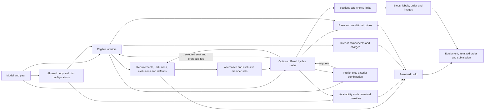

# Form relationships across all six models

September 7, 2026. **Relationship analysis, not an approved table design.** Covers
Stingray, Grand Sport, Grand Sport X, Z06, ZR1 and ZR1X against the frozen workbook
and browser revision. This replaces the options-only starting point for schema
review. It does not change the candidate schema, form behavior or source facts.

The design must cover the complete relationship set before choosing table
boundaries. Shared rule mechanics, shared source facts, and model-specific
applications are different things. Neither six independent copies of everything
nor one universal rule set is supported by the evidence.

## Read the map as business relationships

The boxes below are concepts, not proposed SQL tables. A line means an actual
relationship the existing form needs; it does not prescribe an ID column.



All rule applications have a model context. Applicable configurations, active
flags and the selected build can narrow that context further. A shared rule can
have several explicit applications; this is not an inheritance tree in which an
RPO is made a root identity and its meaning reconstructed down the tree.

## Complete relationship register

Source role names below resolve through `model_workbook_sources`, not filename
guessing. The [blueprint source map](workbook-translation-blueprint.md#complete-source-family-map)
provides the current candidate destinations. Those destinations are evidence of
what was imported, not instructions for the next schema.

| Relationship / one fact means | Source evidence | How the form uses it; ownership question |
|---|---|---|
| A model exists for a year and participates in the published model list | `model_master`, `model_registry_promotion` | Setup, default model, aliases and dataset selection. Product identity, presentation and compatibility identifiers need distinct purposes, not generic duplicate IDs. |
| A model allows a body/trim configuration with a vehicle base price | `variant_master` + `model_variants` | Configuration selection, reset and base MSRP. Membership/active state and both authored order fields are preserved; their future editing ownership is not settled. |
| A model offers an option with code, copy, base price and selection/display policy | Six `source_option_sheet` assignments | Customer choice or equipment record. RPO may be absent or repeated; matching RPO does not establish one shared option identity. |
| An option has a status in a configuration | Six `status_sheet` assignments | Every option/configuration pair has standard, available or unavailable status. Standard is not the same as automatically selected or zero price. |
| An option's policy or section changes for a configuration | Six `variant_option_overrides_sheet` assignments | Overrides selectable/display/section fields before choice generation. Current generator only applies active override rows; inactive rows are retained evidence, not instructions to deactivate the option. |
| A section groups choices and defines single/multiple/display-only and required behavior | `section_master`, `section_presentation` | Section membership affects selection replacement, requirements, default restoration and redundant-exclusion suppression, as well as layout. It is not merely a visual heading. |
| A model/trim allows an interior definition | `lt_interiors`, `LZ_Interiors`, `model_interior_scope` | Eligible interiors additionally depend on selected seat and prerequisites. Shared definition does not imply identical eligibility across models. |
| An interior requires or includes an option | Membership prerequisite, definition's `included_option_id`, and direct rule rows | These are not interchangeable triggers today: generator emits the special `requires_z25` flag, the frozen browser does not read that flag (or `requires_r6x`); executable requires/includes rows drive generic rule behavior. Retained included/required references must be reconciled with the executable rules before choosing a single future owner. |
| An interior contains ordered components referring to component rates | `interior_components`, `PriceRef` | Type/code/trim resolves a rate, falling back from exact trim to universal. Seat, R6X and extras must each have one charge owner; see known R6X correction. |
| An interior is presented in a grouping path with labels and order | `model_interior_scope` hierarchy and presentation fields | Seat/color/material/leaf navigation. A path node, its label and an interior's membership are relationships; repeated label text does not itself justify separate editable facts. |
| Selecting a source requires a target | Six `rule_mapping_sheet` assignments, `requires` | Prerequisite; it does not automatically select the target. Source/target can be option or interior where permitted. Scope and availability apply. |
| Selecting a source includes a target | Same, `includes` | Automatic inclusion closure, limited by exclusions, target prerequisites, user choices and exclusive groups. More than simple pair membership. |
| A source excludes a target | Same, `excludes` | Conflict checking and reconciliation; an ordinary exclusion is not an instruction to replace a selected choice. |
| A source explicitly replaces a target | Same, `runtime_action=replace`; five Z06 code permissions | Removes the selected target and can notify the user. Preserve authored direction and the five permitted derived pairs. Do not infer replacements from every exclusion. |
| A source requires one of a member set | `rule_groups_sheet` + `rule_group_members_sheet`, `requires_any` | OR across members; multiple applicable prerequisite groups remain separate obligations. Corresponding direct requires rows are suppressed in generation to avoid changing OR to AND. |
| A source excludes a member set | Same, `excludes_any` | Scoped conflict set. A common subset of members does not make two complete groups equivalent. |
| A set allows at most one, or requires exactly one, selected member | `exclusive_groups_sheet` + `exclusive_group_members_sheet` | Peer removal/locking, alternative selection, required-choice checks and defaults. These groups can span product sections. |
| A selected option/interior changes an option's price | Six `price_rules_sheet` assignments | Conditional total override, not an arbitrary surcharge. Scope, first-match order and package pricing precedence matter. Current workbook price scopes are body/trim. |
| Several price conditions describe a package base and component deltas | Price rules + exclusive membership; browser `packageComponentPriceRules` | Runtime recognizes positive, differing conditional totals whose conditions belong to single-choice groups. Minimum becomes package base; selected component gets a nonnegative delta. This inferred relationship needs an explicit design decision, not another guessed price field. |
| A default chooses a target when its condition permits | `default_selection_rules`; option `default_selected`; required sections | Four authored conditions plus section/default-selection mechanics. User-selected versus automatically added versus default-selected state changes outcomes. |
| An interior AND an exterior option require an added option | `color_overrides_sheet` + model interior membership | Three endpoints and a model application. `adds_rpo` contains an option ID. Color addition occurs after inclusion closure and checks explicitly selected exterior; it is not a generic unary requires rule. |
| A relationship applies only within a body/trim/configuration scope | Scope columns on direct/group/price/default sources | Scope belongs to the rule application. Direct body matching differs from token-list matching; retain the distinction until intentional replacement behavior is specified. |
| A model places sections in steps and routes steps into summary sections | `context_section_master`, `section_presentation`, `runtime_steps`, `order_summary_sections`, `step_order_summary_map` | Navigation, required markers, standard/automatic equipment buckets and summary routing. Preserve the relationship independently of source row numbers. |
| A model/body/trim context has display copy | `context_choice_copy`, model setup copy/facts | Body-specific copy precedes general copy. Body/trim choices themselves derive from allowed configurations. |
| A model, option, interior or context choice has image assignments | `asset_map` | Explicit model image overrides shared option image; URL/hover/fit/position are presentation facts. Missing images do not alter eligibility or price. |
| An accepted fact or relationship came from a source record or code policy | All source rows, source routing/dispositions, 12 code-evidence entries | Preserve provenance and nonapplicability without making workbook addresses domain keys. Six `rule_phrase_map` rows are historical intake evidence; `runtime_rule_exceptions` has no records. |
| The resolved configuration becomes equipment, itemized price, order and submission | Generated contract + browser `lineItems`, `currentOrder`, `compactOrder`, `dealerSubmissionPayload` | Outputs derive from the same selected/automatic build. Submission formatting and runtime aliases are compatibility concerns, not extra copies of editable product facts. |

## All six models: record coverage

These are imported records, including records suppressed or inactive at runtime.
Counts do not assert that their behavior has been independently tested.

| Relationship | Stingray | Grand Sport | Grand Sport X | Z06 | ZR1 | ZR1X |
|---|---:|---:|---:|---:|---:|---:|
| Configurations | 6 | 6 | 6 | 6 | 4 | 4 |
| Options | 242 | 241 | 239 | 244 | 207 | 206 |
| Option/configuration availability | 1452 | 1446 | 1434 | 1464 | 828 | 824 |
| Contextual option overrides | 4 | 4 | 4 | 4 | 0 | 0 |
| Interior memberships | 130 | 132 | 132 | 130 | 90 | 90 |
| Interior component memberships | 197 | 198 | 198 | 197 | 127 | 127 |
| Direct requires/includes/excludes/replace rows | 178 | 157 | 144 | 110 | 98 | 96 |
| Requires-any/excludes-any groups | 27 | 49 | 43 | 35 | 5 | 4 |
| Members of those groups | 155 | 324 | 268 | 178 | 44 | 43 |
| Exclusive groups | 10 | 12 | 9 | 13 | 9 | 8 |
| Exclusive members | 36 | 37 | 28 | 48 | 24 | 22 |
| Conditional prices | 52 | 55 | 51 | 72 | 34 | 33 |
| Authored defaults | 4 | 4 | 3 | 5 | 6 | 6 |
| Color combinations | 269 | 281 | 281 | 269 | 214 | 214 |
| Code-permitted replacements | 0 | 0 | 0 | 5 | 0 | 0 |
| Asset assignments | 88 | 103 | 101 | 93 | 69 | 68 |

The [model review](model-rule-review.md#observed-differences-by-model) splits these
by effect/condition and retains model-specific package, brake, belt and default
obligations. The complete export described below also covers every presentation,
hierarchy, scope and shared-definition record, not only this matrix.

## What is actually shared, and what only looks shared

### Stripes and graphics

The same exclusion mechanism operates across models; complete member sets differ.
These are actual source rows, with original membership order retained in the export.

| Source condition | Shared part / model difference | Source anchors |
|---|---|---|
| CF8 roof excludes stripes | Stingray and Z06 name the same 13 full-length stripe codes. Grand Sport adds DMU/DMV/DMW/DMX/DMY center stripes. Grand Sport X includes those center stripes and DTC, but its listed set omits DUW. | `rule_groups!8`, `z06_rule_groups!8`, `grandSport_rule_groups!6`, `grand_sport_x_rule_groups!44` |
| DPB stripe excludes hood graphics | Stingray lists SB7/SHT; Grand Sport, Grand Sport X and Z06 list SHT/SNE. Grand Sport and Grand Sport X also have separate DPB exclusions for heritage hashes/Z15. | `rule_groups!11`, `grandSport_rule_groups!12,!30`, `grand_sport_x_rule_groups!2–3`, `z06_rule_groups!21` |
| R88 illuminated emblem excludes badges/stripes | Stingray, Z06, ZR1 and ZR1X share the listed member set, but Stingray orders it differently. Grand Sport adds center-stripe members. | `rule_groups!6`, `z06_rule_groups!6`, `zr1_rule_groups!2`, `zr1x_rule_groups!2`, `grandSport_rule_groups!4` |
| SB9 hood/roof decal excludes full-length stripes | Matching listed members in ZR1 and ZR1X. This does not establish the same availability outside those applications. | `zr1_rule_groups!4`, `zr1x_rule_groups!4` |

A reusable stripe set with explicit additions/differences may be justified, but
there is no accepted universal "stripe rule" yet. Preserve member order separately
from logical set equality: it can change displayed explanations and generated output.
Do not silently repair apparent DTC/DUW differences as part of migration.

### Accessories

Black wheel locks **SPZ require black lug nuts SPY in all six models**. The exact
relationship occurs at `rule_mapping!99`, `grandSport_rule_mapping!86`,
`grand_sport_x_rule_mapping!77`, `z06_rule_mapping!27`, `zr1_rule_mapping!37`,
and `zr1x_rule_mapping!36`. It is a strong shared-rule candidate with six model
applications, subject to each model's availability and other rules.

Chrome wheel locks **SFE do not have one universal exclusion set**:

| Model | Direct SFE exclusions |
|---|---|
| Stingray | SPY |
| Grand Sport, Grand Sport X, Z06 | SPY, ROY, ROZ, STZ |
| ZR1, ZR1X | SPY, SU1 |

The per-model direct-rule records retain each exact source row, direction and
scope. Likewise, the indoor-cover exclusive set is RWH/WKR in ZR1 and ZR1X but
RWH/WKR/WKS in Z06 (`zr1_exclusive_groups!3`, `zr1x_exclusive_groups!3`,
`z06_exclusive_groups!3`). An accessory category is not itself a behavioral rule.

CAV cargo liners at 230, VYW premium floor mats at 275, RWU organizer at 175 and
W2D cargo net at 125 appear in all six option sheets. Equal names/prices are
comparison evidence, not proof of shared edit ownership. Their incoming rules,
section/exclusive memberships and full availability must accompany any proposal
to share the underlying option, not just the outbound rules.

### Color combinations and interiors

Five models route to `color_overrides`. Grand Sport X explicitly routes to
`grand_sport_x_color_overrides`. The current import expands source rows only where
the model has the referenced interior; it does not duplicate every row into every
model. Source-level sharing is measurable:

| Source-row application set | Distinct source rows |
|---|---:|
| Stingray and Grand Sport | 269 |
| Grand Sport only | 12 |
| Z06, ZR1 and ZR1X | 214 |
| Z06 only | 55 |
| Grand Sport X's separate source | 281 |

These 831 source rows produce 1,528 model-qualified color relationships. For
example `color_overrides!2` combines interior `1LT_AQ9_HUQ` with exterior G26 and
requires D30 in Stingray and Grand Sport. The condition is the complete interior
identity plus the exterior option, not interior color text alone.

Stingray/Grand Sport/Grand Sport X use `lt_interiors`; Z06/ZR1/ZR1X use
`LZ_Interiors`. There are 262 shared definitions, 704 model memberships and 21
component rates. Shared source definitions and rates already exist; we must not
flatten away their legitimate relationships merely to remove tables.

R6X is shared behavior with explicit qualifying memberships in every model.
Its settled requirement is additive seat + R6X + extras, each once. The frozen
browser's omitted AE4 charge remains a [known correction](model-rule-review.md#executed-r6x-review),
not a reason to retain three independent price owners or to copy its defect into
the intended relationship model.

### Exhaustive comparison candidates, not automatic deduplication

The export compares every stored direct, grouped, exclusive, price, default,
color and derived-permission record across models. It contains **801 matching
patterns spanning multiple models**: 202 direct, 22 grouped, 8 exclusive, 71 price,
3 default and 495 color patterns; no cross-model derived-permission pattern.
All unmatched records remain available in their original model collections.

Matching compares effect/action/amount/active fields, endpoint kind + local key +
RPO, exact scopes and ordered member fields. It omits rule ID, prose and workbook
sequence from the comparison; originals remain attached. Consequently this is a
conservative search aid, not proof that 801 rules should become shared owners.
Different local keys or member orders can hide genuinely common parts; identical
patterns can still interact with different availability, priorities or surrounding
rules. A rule can be reusable while its option's price or presentation remains
model-specific. Shared rule logic does not require shared option identity.

## Relationships created or changed by execution

The runtime adds meaning beyond stored pair lists. Review these joins and their
order before designing a replacement evaluator:

| Stage | Inputs and outcome | Reference functions |
|---|---|---|
| Generate choices | Model configurations × options × availability; contextual policy/section overrides; unavailable fallback rows and display flags | `Catalog.generate`, `display` |
| Generate rules | Active emitted entities + member groups; suppress grouped direct prerequisites, mark redundant same-single-section exclusions inactive; derive only approved Z06 replacements | `Catalog.rules`, `Catalog.groups` |
| Select / deselect | Section choice mode and exclusive membership replace peers or prevent clearing required groups; record explicit user intent | `handleChoice`, `wouldClearRequiredExclusiveGroup` |
| Resolve interior | Model/trim/seat eligibility and direct rules; invalidate or choose the sole eligible interior | `validInteriorsForSelectedSeat`, `reconcileInteriorSelection`, `disableReasonForInterior` |
| Resolve automatic equipment | Includes closure subject to availability, exclusions, target prerequisites, explicit user peers and group locks; then apply color combinations | `computeAutoAdded`, `includedRuleLocksAgainstPeer` |
| Reconcile and restore | Exceptions/replacements → invalid selections → interior → auto additions → invalid selections/duplicates/locked peers → refreshed additions → workbook defaults → authored defaults → RPO deduplication | `reconcileSelections` |
| Apply defaults | Always; unless selected RPO; unless selected/automatic section; when selected/automatic source unless a user choice exists in target's resolved section. Respect scope, priority and exclusive peers. | `addGeneratedDefaultChoices`, `resetDefaults` |
| Resolve price | Component delta → selected package minimum base → first matching scoped conditional total → option base; interior components and residual amount are itemized separately | `optionPrice`, `lineItemsFromInterior`, `lineItems` |
| Validate and output | Required section/exclusive-group and prerequisite state; same resolved build supplies ordered summary, prices, export and dealer payload | `missingRequirementDetails`, `currentOrder`, `compactOrder`, `dealerSubmissionPayload` |

Direct body scope uses nonblank exact equality. Browser `scopeMatches` splits
pipe-delimited tokens, trims them, and accepts empty lists or a star token as
universal, with case-sensitive matching. Generator `matches` does not trim tokens
and only recognizes the whole `'*'` string as universal. Do not call these one
identical scope implementation. Current price sources have body/trim scopes;
groups and defaults also have variant scopes.

The generator labels redundant direct exclusions `active=False`, but the browser
indexes all direct rules and its core rule checks do not consistently test that
flag. The label alone therefore does not prove a rule is behaviorally inactive.
This distinction must remain visible in the mapping.

Runtime indexes also matter: one representative choice per option supplies some
section/price lookup, and the exclusive-group index keeps the last group found
for an option. RPO deduplication prefers selectable non-equipment choices. These
are existing algorithmic decisions to evaluate against intent, not new database
constraints to impose without review.

## Complete record map and evidence

Use the existing review exporter, now expanded to include **every typed record**:

```sh
python3 -m catalog.rule_inventory \
  --database .local/consolidate-options/after.sqlite \
  --output .local/relationship-map/all-model-records.json
```

A candidate built with `python -m catalog.importer --output NEW_PATH` can be used
instead. Use its path in the command; schema-2 candidates must be rebuilt.

- `models[model].model`, `.variants`, `.families`: all model-owned records,
  including availability, options, rules, interiors, hierarchy, presentation,
  assets and publication. Each record has complete fields, resolved references
  and workbook row locations. Rule members/scopes are nested with their owners.
- `shared_sections`, `shared_interior_definitions`, `shared_component_rates`:
  shared records and references; these are not presumed final table boundaries.
- `cross_model_matches`: all comparison candidates above, with every model
  occurrence, rule ID, sequence and source row. Follow the ID back to the complete
  record for prose and its surrounding relationships.
- `record_counts`, `source_sheets`, `source_dispositions`, `code_evidence`:
  coverage and explicit nonapplicability/historical evidence. Raw source cells
  remain in the frozen archive/candidate evidence store rather than being copied
  again into this review export.

Coverage is 35 typed families / 23,588 records, including every reference and all
7,448 availability pairs. All 77 source sheets / 15,134 populated rows remain
accounted for by the importer. The export is a review artifact; internal UUIDs,
legacy names and source-order fields are shown to trace the current implementation,
not proposed as future authoring fields.

Evidence baseline: workbook SHA-256
`3127e663b1531e366ce86b989b6190914108d40dfd15a33a258307a05d608e3c`;
[reference browser](https://github.com/seanzmc/27vette/blob/4fe92a4f078370c478f18484cad31bdafe58ad43/form-app/app.js)
revision `4fe92a4f078370c478f18484cad31bdafe58ad43`. The archive and extracted browser
hashes were checked during this analysis. Color source applications and all six
wheel-lock prerequisite/exclusion sets were also checked directly from the frozen
workbook, independently of candidate relationships. Candidate schema 3 was used read-only.

Validation: six focused exporter tests passed. They compare every typed row, field, reference
and evidence link with a freshly imported candidate, require each record exactly
once, retain ordered members and verify repeatable output without input changes.
Shared wheel-lock comparisons explicitly retain the ZR1/ZR1X-only SU1 exclusion.
This is full stored-relationship coverage and code-path analysis, **not exhaustive
execution of every possible selection combination or approval of baseline defects**.

## What this establishes for the design reset

The follow-on [proposed database design](proposed-database-design.md) assigns
owners and keys to these relationships. The map remains its evidence base; the
proposal does not change the imported records or constitute implemented DDL.

The next schema proposal must assign ownership using this complete map, including
shared rules and explicit model applications. It must resolve how shared member
sets and model differences are authored, how contextual prices have one owner,
and how source/compatibility metadata stays outside editable business ownership.
It must also explain each remaining identity and each distinct order before DDL.

No table count, ID strategy, universal inheritance model, generic rule-expression
language or automatic cross-model merge is approved here. The existing candidate
is an evidence source for this review, not the architecture to preserve. Remaining
behavioral ambiguities and the R6X correction must stay visible when the intended
relationship model differs from the observed browser implementation.
