# Master-schema relationship diagram and key reference

September 13, 2026. Relationship-diagram slice of the
[master-schema proposal §9](master-schema-proposal.md#9-review-outcome-and-next-bounded-work),
prepared from `origin/main` at `a85368e2924cabf64ff57fc1db176f9e9c3c321e`.
Logical documentation for review only: no populated rows, worked traces, DDL,
importer, evaluator, canonical-data changes or implementation approval.

September 14 update: the [worked-example resolutions](master-schema-worked-examples.md#open)
supply the naming, endpoint, evidence and lifecycle design decisions exposed by
this original logical inventory. Read its dagger/M/R notation through those
resolutions. Statements below that a physical detail is unspecified describe the
original diagram slice; the linked resolutions now govern those details. The
family nodes remain compact notation, not generic physical tables. The O6
`release_model_alias` association supplements the original release inventory.
No DDL or executable validation is implied.

## Reading the diagram and keys

This inventories every named relation in proposal §§1–7, including **all nine**
listed typed scope junctions (eight rule/rate/content scopes plus
`visual_binding_configuration`). `option_configuration`, `interior_configuration`,
`component_rate` and `option_presentation_override` retain their direct keys.

`M` is a model-year identity; `R` is its complete revision snapshot. **[R]** marks
an FK containing R. Global and continuing-identity FKs do not acquire R merely
because the referencing fact is revision-owned. Each fact's evidence and nullable
decision-set references are repeated in its own table. Association FKs retain the
entire parent key. The proposal does not explicitly give a direct revision FK to
every association: such a redundant FK is not silently added here.

A dagger (`†`) marks a **notation alias**, not a proposed column name: the source
names the relationship or ID but does not spell its columns. Parenthesized FK
column sets show every required component, with roles distinguishing multiple
references to one table. Where the actual set or relation allocation cannot be
determined, the entry points to [Open](#open). “None specified” means the proposal
states no additional unique constraint; it does not approve any physical design.
Primary-key uniqueness is implicit throughout.

The ER diagram uses dotted relationship lines with conservative bounds
(`|o..o{`): a referencing row has at most one parent per FK; a parent can be
referenced by rows. These are **bounds, not declarations of nullable FKs or exact
minimum/maximum cardinalities**. Required keys and singleton relations tighten
them as stated in the key tables; unspecified cardinalities remain open. Edge labels identify roles; the per-relation
key tables are authoritative for columns and XOR endpoints. `CONFIGURATION_IDENTITY`, `OPTION_IDENTITY`, `INTERIOR_IDENTITY`,
`COMPONENT_IDENTITY`, `RULE_IDENTITY` and `PRESENTATION_IDENTITY` denote the typed
identity families, without assigning physical table names. Rule/presentation
subfamilies remain open. `TYPED_TRANSLATION` and `TYPED_LEGACY_MAPPING` are
repeatable notation templates, not polymorphic tables. `CONCRETE_TARGET` / `CONCRETE_EXPORTED_TARGET` stand
for the actual typed destination; their family expansion is explicitly open.
The six identity notation nodes cover the categories named in §1:
configuration, option, interior, component, rule and presentation. Only the first
four have an unambiguous `(R, id)` version-to-identity mapping; the others are
shown as family nodes with O1 rather than invented concrete subfamilies.

### Identity membership

Relations with a continuing typed `(M, id)` identity row, and the family each
belongs to. Every version row of these relations carries M and holds two FKs:
`(R, M)` → `catalog_revision(R, M)` and `(M, id)` → its identity family
`(M, id)`. That pair is stated here once and not repeated per table.

| Identity family | Relations with `(M, id)` identity rows |
|---|---|
| `CONFIGURATION_IDENTITY` | `configuration` |
| `OPTION_IDENTITY` | `option` |
| `INTERIOR_IDENTITY` | `interior` |
| `COMPONENT_IDENTITY` | `component` |
| `RULE_IDENTITY` | `condition`, `requirement`, `acquisition`, `conflict`, `choice_group`, `replacement_plan`, `option_rate`, `equipment_substitution`, `content_aspect`, `content_effect` |
| `PRESENTATION_IDENTITY` | `step`, `section`, `summary_section`, `visual_scene` |

Whether `RULE_IDENTITY` and `PRESENTATION_IDENTITY` are physically one table per
family with a kind discriminator or one table per relation is a physical choice
left to DDL; logically each relation's identity is distinct within its family and
a version cannot change kind.

All other revision-owned relations are **revision-only** and have no identity
row: every scope junction and association (`option_configuration`,
`interior_configuration`, `interior_part`, `interior_node_member`,
`condition_clause`, `condition_member`, `conflict_member`, `choice_group_member`,
`replacement_action`, `visual_layer`, `visual_binding`, `asset_binding`,
`component_rate`, `context_copy`), per-option or per-configuration facts
(`option_presentation`, `option_presentation_override`, `configuration_policy`,
`emission_policy`, `step_summary`, `context_control`, `model_fact`,
`interior_node`), singleton rows (`model_presentation`, `interaction_policy`),
`source_disposition`, and the translation and legacy link templates. They are
identified within R by their stated primary keys and copied by draft creation.

## Complete relationship diagram

```mermaid
erDiagram
    model
    model_year
    price_basis
    catalog_revision
    CONFIGURATION_IDENTITY
    OPTION_IDENTITY
    INTERIOR_IDENTITY
    COMPONENT_IDENTITY
    RULE_IDENTITY
    PRESENTATION_IDENTITY
    configuration
    option
    option_configuration
    option_presentation_override
    configuration_policy
    model_presentation
    model_fact
    interior
    interior_configuration
    interior_part
    component
    component_rate
    interior_node
    interior_node_member
    condition
    condition_clause
    condition_member
    requirement
    acquisition
    conflict
    conflict_member
    choice_group
    choice_group_member
    replacement_plan
    replacement_action
    option_rate
    equipment_substitution
    content_aspect
    content_effect
    emission_policy
    step
    section
    summary_section
    option_presentation
    step_summary
    context_control
    context_copy
    interaction_policy
    asset
    asset_binding
    visual_scene
    visual_layer
    visual_binding
    requirement_configuration
    acquisition_configuration
    conflict_configuration
    choice_group_configuration
    replacement_plan_configuration
    option_rate_configuration
    equipment_substitution_configuration
    content_effect_configuration
    visual_binding_configuration
    source_document
    source_anchor
    evidence_set
    evidence_member
    review_decision
    decision_set
    decision_member
    source_disposition
    TYPED_TRANSLATION
    TYPED_LEGACY_MAPPING
    release
    release_model
    release_model_alias
    release_artifact
    publication_pointer
    evidence_set |o..o{ review_decision : "required fact evidence O7"
    release_model |o..o{ release_model_alias : "member aliases"
    evidence_set |o..o{ asset : "required fact evidence O7"
    decision_set |o..o{ asset : "nullable decisions"
    decision_set |o..o{ price_basis : "nullable decisions"
    evidence_set |o..o{ price_basis : "required fact evidence O7"
    CONCRETE_TARGET
    CONCRETE_EXPORTED_TARGET
    model |o..o{ model_year : "model"
    model_year |o..o{ catalog_revision : "model_year"
    catalog_revision |o..o{ catalog_revision : "parent in same M"
    model_year |o..o{ CONFIGURATION_IDENTITY : "model_year"
    CONFIGURATION_IDENTITY |o..o{ CONFIGURATION_IDENTITY : "optional same kind predecessor"
    model_year |o..o{ OPTION_IDENTITY : "model_year"
    OPTION_IDENTITY |o..o{ OPTION_IDENTITY : "optional same kind predecessor"
    model_year |o..o{ INTERIOR_IDENTITY : "model_year"
    INTERIOR_IDENTITY |o..o{ INTERIOR_IDENTITY : "optional same kind predecessor"
    model_year |o..o{ COMPONENT_IDENTITY : "model_year"
    COMPONENT_IDENTITY |o..o{ COMPONENT_IDENTITY : "optional same kind predecessor"
    model_year |o..o{ RULE_IDENTITY : "model_year"
    RULE_IDENTITY |o..o{ RULE_IDENTITY : "optional same kind predecessor"
    model_year |o..o{ PRESENTATION_IDENTITY : "model_year"
    PRESENTATION_IDENTITY |o..o{ PRESENTATION_IDENTITY : "optional same kind predecessor"
    price_basis |o..o{ configuration : "price_basis"
    catalog_revision |o..o{ configuration : "version owner"
    CONFIGURATION_IDENTITY |o..o{ configuration : "same concrete kind"
    evidence_set |o..o{ configuration : "fact evidence"
    decision_set |o..o{ configuration : "nullable decisions"
    price_basis |o..o{ option : "price_basis"
    catalog_revision |o..o{ option : "version owner"
    OPTION_IDENTITY |o..o{ option : "same concrete kind"
    evidence_set |o..o{ option : "fact evidence"
    decision_set |o..o{ option : "nullable decisions"
    option |o..o{ option_configuration : "option"
    configuration |o..o{ option_configuration : "configuration"
    evidence_set |o..o{ option_configuration : "fact evidence"
    decision_set |o..o{ option_configuration : "nullable decisions"
    option |o..o{ option_presentation_override : "option"
    configuration |o..o{ option_presentation_override : "configuration"
    section |o..o{ option_presentation_override : "nullable section override"
    evidence_set |o..o{ option_presentation_override : "fact evidence"
    decision_set |o..o{ option_presentation_override : "nullable decisions"
    configuration |o..o{ configuration_policy : "configuration"
    step |o..o{ configuration_policy : "step"
    evidence_set |o..o{ configuration_policy : "fact evidence"
    decision_set |o..o{ configuration_policy : "nullable decisions"
    evidence_set |o..o{ model_presentation : "fact evidence"
    decision_set |o..o{ model_presentation : "nullable decisions"
    evidence_set |o..o{ model_fact : "fact evidence"
    decision_set |o..o{ model_fact : "nullable decisions"
    option |o..o{ interior : "seat"
    catalog_revision |o..o{ interior : "version owner"
    INTERIOR_IDENTITY |o..o{ interior : "same concrete kind"
    evidence_set |o..o{ interior : "fact evidence"
    decision_set |o..o{ interior : "nullable decisions"
    interior |o..o{ interior_configuration : "interior"
    configuration |o..o{ interior_configuration : "configuration"
    evidence_set |o..o{ interior_configuration : "fact evidence"
    decision_set |o..o{ interior_configuration : "nullable decisions"
    interior |o..o{ interior_part : "interior"
    option |o..o{ interior_part : "XOR option part"
    component |o..o{ interior_part : "XOR component part"
    evidence_set |o..o{ interior_part : "fact evidence"
    decision_set |o..o{ interior_part : "nullable decisions"
    catalog_revision |o..o{ component : "version owner"
    COMPONENT_IDENTITY |o..o{ component : "same concrete kind"
    evidence_set |o..o{ component : "fact evidence"
    decision_set |o..o{ component : "nullable decisions"
    component |o..o{ component_rate : "component"
    configuration |o..o{ component_rate : "configuration"
    price_basis |o..o{ component_rate : "price_basis"
    evidence_set |o..o{ component_rate : "fact evidence"
    decision_set |o..o{ component_rate : "nullable decisions"
    interior_node |o..o{ interior_node : "hierarchy parent"
    evidence_set |o..o{ interior_node : "fact evidence"
    decision_set |o..o{ interior_node : "nullable decisions"
    interior_node |o..o{ interior_node_member : "interior_node"
    interior |o..o{ interior_node_member : "interior"
    evidence_set |o..o{ interior_node_member : "fact evidence"
    decision_set |o..o{ interior_node_member : "nullable decisions"
    evidence_set |o..o{ condition : "fact evidence"
    decision_set |o..o{ condition : "nullable decisions"
    condition |o..o{ condition_clause : "condition"
    evidence_set |o..o{ condition_clause : "fact evidence"
    decision_set |o..o{ condition_clause : "nullable decisions"
    condition_clause |o..o{ condition_member : "condition_clause"
    option |o..o{ condition_member : "XOR option"
    interior |o..o{ condition_member : "XOR interior"
    choice_group |o..o{ condition_member : "XOR group"
    evidence_set |o..o{ condition_member : "fact evidence"
    decision_set |o..o{ condition_member : "nullable decisions"
    option |o..o{ requirement : "XOR source option"
    interior |o..o{ requirement : "XOR source interior"
    condition |o..o{ requirement : "activation"
    condition |o..o{ requirement : "satisfaction"
    evidence_set |o..o{ requirement : "fact evidence"
    decision_set |o..o{ requirement : "nullable decisions"
    condition |o..o{ acquisition : "condition"
    option |o..o{ acquisition : "target"
    evidence_set |o..o{ acquisition : "fact evidence"
    decision_set |o..o{ acquisition : "nullable decisions"
    option |o..o{ conflict : "XOR source option"
    interior |o..o{ conflict : "XOR source interior"
    condition |o..o{ conflict : "activation"
    evidence_set |o..o{ conflict : "fact evidence"
    decision_set |o..o{ conflict : "nullable decisions"
    conflict |o..o{ conflict_member : "conflict"
    option |o..o{ conflict_member : "XOR option"
    interior |o..o{ conflict_member : "XOR interior"
    evidence_set |o..o{ conflict_member : "fact evidence"
    decision_set |o..o{ conflict_member : "nullable decisions"
    evidence_set |o..o{ choice_group : "fact evidence"
    decision_set |o..o{ choice_group : "nullable decisions"
    choice_group |o..o{ choice_group_member : "choice_group"
    option |o..o{ choice_group_member : "option"
    evidence_set |o..o{ choice_group_member : "fact evidence"
    decision_set |o..o{ choice_group_member : "nullable decisions"
    option |o..o{ replacement_plan : "requested option"
    condition |o..o{ replacement_plan : "condition"
    evidence_set |o..o{ replacement_plan : "fact evidence"
    decision_set |o..o{ replacement_plan : "nullable decisions"
    replacement_plan |o..o{ replacement_action : "replacement_plan"
    option |o..o{ replacement_action : "add or remove"
    evidence_set |o..o{ replacement_action : "fact evidence"
    decision_set |o..o{ replacement_action : "nullable decisions"
    option |o..o{ option_rate : "charge owner"
    condition |o..o{ option_rate : "condition"
    price_basis |o..o{ option_rate : "price_basis"
    evidence_set |o..o{ option_rate : "fact evidence"
    decision_set |o..o{ option_rate : "nullable decisions"
    condition |o..o{ equipment_substitution : "condition"
    option |o..o{ equipment_substitution : "removed"
    option |o..o{ equipment_substitution : "optional replacement"
    evidence_set |o..o{ equipment_substitution : "fact evidence"
    decision_set |o..o{ equipment_substitution : "nullable decisions"
    evidence_set |o..o{ content_aspect : "fact evidence"
    decision_set |o..o{ content_aspect : "nullable decisions"
    condition |o..o{ content_effect : "condition"
    content_aspect |o..o{ content_effect : "content_aspect"
    evidence_set |o..o{ content_effect : "fact evidence"
    decision_set |o..o{ content_effect : "nullable decisions"
    summary_section |o..o{ emission_policy : "summary destination"
    option |o..o{ emission_policy : "option"
    evidence_set |o..o{ emission_policy : "fact evidence"
    decision_set |o..o{ emission_policy : "nullable decisions"
    evidence_set |o..o{ step : "fact evidence"
    decision_set |o..o{ step : "nullable decisions"
    step |o..o{ section : "step"
    evidence_set |o..o{ section : "fact evidence"
    decision_set |o..o{ section : "nullable decisions"
    evidence_set |o..o{ summary_section : "fact evidence"
    decision_set |o..o{ summary_section : "nullable decisions"
    option |o..o{ option_presentation : "option"
    section |o..o{ option_presentation : "section"
    evidence_set |o..o{ option_presentation : "fact evidence"
    decision_set |o..o{ option_presentation : "nullable decisions"
    step |o..o{ step_summary : "step"
    summary_section |o..o{ step_summary : "summary_section"
    evidence_set |o..o{ step_summary : "fact evidence"
    decision_set |o..o{ step_summary : "nullable decisions"
    evidence_set |o..o{ context_control : "fact evidence"
    decision_set |o..o{ context_control : "nullable decisions"
    context_control |o..o{ context_copy : "context_control"
    configuration |o..o{ context_copy : "configuration"
    evidence_set |o..o{ context_copy : "fact evidence"
    decision_set |o..o{ context_copy : "nullable decisions"
    evidence_set |o..o{ interaction_policy : "fact evidence"
    decision_set |o..o{ interaction_policy : "nullable decisions"
    asset |o..o{ asset_binding : "asset"
    option |o..o{ asset_binding : "XOR option"
    interior |o..o{ asset_binding : "XOR interior"
    configuration |o..o{ asset_binding : "XOR configuration"
    evidence_set |o..o{ asset_binding : "fact evidence"
    decision_set |o..o{ asset_binding : "nullable decisions"
    evidence_set |o..o{ visual_scene : "fact evidence"
    decision_set |o..o{ visual_scene : "nullable decisions"
    visual_scene |o..o{ visual_layer : "visual_scene"
    evidence_set |o..o{ visual_layer : "fact evidence"
    decision_set |o..o{ visual_layer : "nullable decisions"
    visual_layer |o..o{ visual_binding : "visual_layer"
    asset |o..o{ visual_binding : "asset"
    condition |o..o{ visual_binding : "condition"
    evidence_set |o..o{ visual_binding : "fact evidence"
    decision_set |o..o{ visual_binding : "nullable decisions"
    requirement |o..o{ requirement_configuration : "requirement"
    configuration |o..o{ requirement_configuration : "configuration"
    evidence_set |o..o{ requirement_configuration : "fact evidence"
    decision_set |o..o{ requirement_configuration : "nullable decisions"
    acquisition |o..o{ acquisition_configuration : "acquisition"
    configuration |o..o{ acquisition_configuration : "configuration"
    evidence_set |o..o{ acquisition_configuration : "fact evidence"
    decision_set |o..o{ acquisition_configuration : "nullable decisions"
    conflict |o..o{ conflict_configuration : "conflict"
    configuration |o..o{ conflict_configuration : "configuration"
    evidence_set |o..o{ conflict_configuration : "fact evidence"
    decision_set |o..o{ conflict_configuration : "nullable decisions"
    choice_group |o..o{ choice_group_configuration : "choice_group"
    configuration |o..o{ choice_group_configuration : "configuration"
    evidence_set |o..o{ choice_group_configuration : "fact evidence"
    decision_set |o..o{ choice_group_configuration : "nullable decisions"
    replacement_plan |o..o{ replacement_plan_configuration : "replacement_plan"
    configuration |o..o{ replacement_plan_configuration : "configuration"
    evidence_set |o..o{ replacement_plan_configuration : "fact evidence"
    decision_set |o..o{ replacement_plan_configuration : "nullable decisions"
    option_rate |o..o{ option_rate_configuration : "option_rate"
    configuration |o..o{ option_rate_configuration : "configuration"
    evidence_set |o..o{ option_rate_configuration : "fact evidence"
    decision_set |o..o{ option_rate_configuration : "nullable decisions"
    equipment_substitution |o..o{ equipment_substitution_configuration : "equipment_substitution"
    configuration |o..o{ equipment_substitution_configuration : "configuration"
    evidence_set |o..o{ equipment_substitution_configuration : "fact evidence"
    decision_set |o..o{ equipment_substitution_configuration : "nullable decisions"
    content_effect |o..o{ content_effect_configuration : "content_effect"
    configuration |o..o{ content_effect_configuration : "configuration"
    evidence_set |o..o{ content_effect_configuration : "fact evidence"
    decision_set |o..o{ content_effect_configuration : "nullable decisions"
    visual_binding |o..o{ visual_binding_configuration : "visual_binding"
    configuration |o..o{ visual_binding_configuration : "configuration"
    evidence_set |o..o{ visual_binding_configuration : "fact evidence"
    decision_set |o..o{ visual_binding_configuration : "nullable decisions"
    source_document |o..o{ source_anchor : "source_document"
    evidence_set |o..o{ evidence_member : "evidence_set"
    source_anchor |o..o{ evidence_member : "source_anchor"
    decision_set |o..o{ decision_member : "decision_set"
    review_decision |o..o{ decision_member : "review_decision"
    source_anchor |o..o{ source_disposition : "source_anchor"
    evidence_set |o..o{ source_disposition : "fact evidence"
    decision_set |o..o{ source_disposition : "nullable decisions"
    source_disposition |o..o{ TYPED_TRANSLATION : "source_disposition"
    CONCRETE_TARGET |o..o{ TYPED_TRANSLATION : "CONCRETE_TARGET"
    evidence_set |o..o{ TYPED_TRANSLATION : "fact evidence"
    decision_set |o..o{ TYPED_TRANSLATION : "nullable decisions"
    CONCRETE_EXPORTED_TARGET |o..o{ TYPED_LEGACY_MAPPING : "CONCRETE_EXPORTED_TARGET"
    evidence_set |o..o{ TYPED_LEGACY_MAPPING : "fact evidence"
    decision_set |o..o{ TYPED_LEGACY_MAPPING : "nullable decisions"
    release_model |o..o{ release : "default member"
    release |o..o{ release_model : "release"
    model_year |o..o{ release_model : "model_year"
    catalog_revision |o..o{ release_model : "catalog_revision"
    release |o..o{ release_artifact : "release"
    release |o..o{ publication_pointer : "completed release"
```

The common evidence/decision edges above apply to every revision-owned authored
fact, including scope, association, translation and legacy-mapping rows (§7).
They do not invent source anchors as product identities. Review decisions and
price bases carry evidence; the two OPEN edges indicate unresolved evidence
representation, not confirmed evidence-set FKs (O7).
Rule/presentation version-to-identity edges, unspecified replacement triggers,
and lineage for global/identity rows cannot be expanded into concrete FKs without
settling the open items below. These omissions from concrete edges are explicit,
not implied absence of the relationships.

## Key and FK table per relation

Each table below corresponds to one named relation, or to one expressly named
typed family template. Composite source/target tuples are never scalar IDs.
Each continuing identity category has its own key table; rule/presentation
families require the O1 expansion into concrete kinds.

### `model`

| Key / constraint | Definition |
|---|---|
| Primary key | `(model_id)` |
| Foreign keys | None explicitly specified; see notes where relationship details are open. |
| Unique constraints | Model key (column name unspecified). |

### `model_year`

| Key / constraint | Definition |
|---|---|
| Primary key | `(M)` |
| FK — model | `(model_id)` → `model(model_id)` |
| Unique constraints | (model_id, year); (M, model_id, year). |

### `price_basis`

| Key / constraint | Definition |
|---|---|
| Primary key | `(basis_id†)` |
| FK — required evidence | `(evidence_set_id)` → `evidence_set(set_id)` |
| FK — nullable decisions | `(decision_set_id)` → `decision_set(set_id)` |
| Unique constraints | None specified beyond the primary key. |

Immutable. Source evidence uses the required set FK (O7). Currency is a value; no currency relation is named.

### `catalog_revision`

| Key / constraint | Definition |
|---|---|
| Primary key | `(R)` |
| FK — model_year | `(M)` → `model_year(M)` |
| FK **[R]** — parent in same M | `(parent_R†, M)` → `catalog_revision(R, M)` |
| Unique constraints | (M, revision_number); (R, M). |

Parent revision is in M; parent column name and nullability are unspecified. Frozen state is a lifecycle constraint, not an FK.

### `CONFIGURATION_IDENTITY`

| Key / constraint | Definition |
|---|---|
| Primary key | `(M, id)` |
| FK — model_year | `(M)` → `model_year(M)` |
| FK — optional same kind predecessor | `(predecessor_M†, predecessor_id†)` → `CONFIGURATION_IDENTITY(M, id)` |
| Unique constraints | None specified beyond the primary key. |

Notation for the configuration typed identity family in §1, not an assigned physical table name. Continuing configuration identity; its version row references this full key. Predecessor is optional, typed, reviewed and may refer to an earlier M; no facts inherit by fallback.

### `OPTION_IDENTITY`

| Key / constraint | Definition |
|---|---|
| Primary key | `(M, id)` |
| FK — model_year | `(M)` → `model_year(M)` |
| FK — optional same kind predecessor | `(predecessor_M†, predecessor_id†)` → `OPTION_IDENTITY(M, id)` |
| Unique constraints | None specified beyond the primary key. |

Notation for the option typed identity family in §1, not an assigned physical table name. Continuing option identity; its version row references this full key. Predecessor is optional, typed, reviewed and may refer to an earlier M; no facts inherit by fallback.

### `INTERIOR_IDENTITY`

| Key / constraint | Definition |
|---|---|
| Primary key | `(M, id)` |
| FK — model_year | `(M)` → `model_year(M)` |
| FK — optional same kind predecessor | `(predecessor_M†, predecessor_id†)` → `INTERIOR_IDENTITY(M, id)` |
| Unique constraints | None specified beyond the primary key. |

Notation for the interior typed identity family in §1, not an assigned physical table name. Continuing interior identity; its version row references this full key. Predecessor is optional, typed, reviewed and may refer to an earlier M; no facts inherit by fallback.

### `COMPONENT_IDENTITY`

| Key / constraint | Definition |
|---|---|
| Primary key | `(M, id)` |
| FK — model_year | `(M)` → `model_year(M)` |
| FK — optional same kind predecessor | `(predecessor_M†, predecessor_id†)` → `COMPONENT_IDENTITY(M, id)` |
| Unique constraints | None specified beyond the primary key. |

Notation for the component typed identity family in §1, not an assigned physical table name. Continuing component identity; its version row references this full key. Predecessor is optional, typed, reviewed and may refer to an earlier M; no facts inherit by fallback.

### `RULE_IDENTITY`

| Key / constraint | Definition |
|---|---|
| Primary key | `(M, id)` |
| FK — model_year | `(M)` → `model_year(M)` |
| FK — optional same kind predecessor | `(predecessor_M†, predecessor_id†)` → `RULE_IDENTITY(M, id)` |
| Unique constraints | None specified beyond the primary key. |

Notation for the rule typed identity family in §1, not an assigned physical table name. Member relations are listed under [Identity membership](#identity-membership); physical table split is open (O1). Predecessor is optional, typed, reviewed and may refer to an earlier M; no facts inherit by fallback.

### `PRESENTATION_IDENTITY`

| Key / constraint | Definition |
|---|---|
| Primary key | `(M, id)` |
| FK — model_year | `(M)` → `model_year(M)` |
| FK — optional same kind predecessor | `(predecessor_M†, predecessor_id†)` → `PRESENTATION_IDENTITY(M, id)` |
| Unique constraints | None specified beyond the primary key. |

Notation for the presentation typed identity family in §1, not an assigned physical table name. Member relations are listed under [Identity membership](#identity-membership); physical table split is open (O1). Predecessor is optional, typed, reviewed and may refer to an earlier M; no facts inherit by fallback.

### `configuration`

| Key / constraint | Definition |
|---|---|
| Primary key | `(R, id)` |
| FK — price_basis | `(basis_id†)` → `price_basis(basis_id†)` |
| FK **[R]** — version owner | `(R, M)` → `catalog_revision(R, M)` |
| FK — same concrete kind | `(M, id)` → `CONFIGURATION_IDENTITY(M, id)` |
| FK — fact evidence | `(evidence_set_id†)` → `evidence_set(set_id†)` |
| FK — nullable decisions | `(decision_set_id†)` → `decision_set(set_id†)` |
| Unique constraints | (R, body, trim). |

### `option`

| Key / constraint | Definition |
|---|---|
| Primary key | `(R, id)` |
| FK — price_basis | `(basis_id†)` → `price_basis(basis_id†)` |
| FK **[R]** — version owner | `(R, M)` → `catalog_revision(R, M)` |
| FK — same concrete kind | `(M, id)` → `OPTION_IDENTITY(M, id)` |
| FK — fact evidence | `(evidence_set_id†)` → `evidence_set(set_id†)` |
| FK — nullable decisions | `(decision_set_id†)` → `decision_set(set_id†)` |
| Unique constraints | None specified beyond the primary key. |

RPO is nullable and nonunique; names, rows and hashes are not identities.

### `option_configuration`

| Key / constraint | Definition |
|---|---|
| Primary key | `(R, option_id, configuration_id)` |
| FK **[R]** — option | `(R, option_id)` → `option(R, id)` |
| FK **[R]** — configuration | `(R, configuration_id)` → `configuration(R, id)` |
| FK — fact evidence | `(evidence_set_id†)` → `evidence_set(set_id†)` |
| FK — nullable decisions | `(decision_set_id†)` → `decision_set(set_id†)` |
| Unique constraints | None specified beyond the primary key. |

Complete standard/available/unavailable matrix, including unavailable pairs.

### `option_presentation_override`

| Key / constraint | Definition |
|---|---|
| Primary key | `(R, option_id, configuration_id)` |
| FK **[R]** — option | `(R, option_id)` → `option(R, id)` |
| FK **[R]** — configuration | `(R, configuration_id)` → `configuration(R, id)` |
| FK **[R]** — nullable section override | `(R, section_id†)` → `section(R, id)` |
| FK — fact evidence | `(evidence_set_id†)` → `evidence_set(set_id†)` |
| FK — nullable decisions | `(decision_set_id†)` → `decision_set(set_id†)` |
| Unique constraints | None specified beyond the primary key. |

No additional FK to option_presentation is stated. Null override inherits.

### `configuration_policy`

| Key / constraint | Definition |
|---|---|
| Primary key | `(R, configuration_id)` |
| FK **[R]** — configuration | `(R, configuration_id)` → `configuration(R, id)` |
| FK **[R]** — step | `(R, step_id†)` → `step(R, id)` |
| FK — fact evidence | `(evidence_set_id†)` → `evidence_set(set_id†)` |
| FK — nullable decisions | `(decision_set_id†)` → `decision_set(set_id†)` |
| Unique constraints | None specified beyond the primary key. |

### `model_presentation`

| Key / constraint | Definition |
|---|---|
| Primary key | `(R)` |
| FK — fact evidence | `(evidence_set_id†)` → `evidence_set(set_id†)` |
| FK — nullable decisions | `(decision_set_id†)` → `decision_set(set_id†)` |
| Unique constraints | None specified beyond the primary key. |

R owns the row; revision-only, no identity row. Direct catalog_revision FK column is unspecified (O1).

### `model_fact`

| Key / constraint | Definition |
|---|---|
| Primary key | `(R, fact_id)` |
| FK — fact evidence | `(evidence_set_id†)` → `evidence_set(set_id†)` |
| FK — nullable decisions | `(decision_set_id†)` → `decision_set(set_id†)` |
| Unique constraints | None specified beyond the primary key. |

Revision-only, no identity row. Owner FK column details are open (O1).

### `interior`

| Key / constraint | Definition |
|---|---|
| Primary key | `(R, id)` |
| FK **[R]** — seat | `(R, seat_option_id†)` → `option(R, id)` |
| FK **[R]** — version owner | `(R, M)` → `catalog_revision(R, M)` |
| FK — same concrete kind | `(M, id)` → `INTERIOR_IDENTITY(M, id)` |
| FK — fact evidence | `(evidence_set_id†)` → `evidence_set(set_id†)` |
| FK — nullable decisions | `(decision_set_id†)` → `decision_set(set_id†)` |
| Unique constraints | None specified beyond the primary key. |

### `interior_configuration`

| Key / constraint | Definition |
|---|---|
| Primary key | `(R, interior_id, configuration_id)` |
| FK **[R]** — interior | `(R, interior_id)` → `interior(R, id)` |
| FK **[R]** — configuration | `(R, configuration_id)` → `configuration(R, id)` |
| FK — fact evidence | `(evidence_set_id†)` → `evidence_set(set_id†)` |
| FK — nullable decisions | `(decision_set_id†)` → `decision_set(set_id†)` |
| Unique constraints | None specified beyond the primary key. |

### `interior_part`

| Key / constraint | Definition |
|---|---|
| Primary key | `(R, interior_id, part_key)` |
| FK **[R]** — interior | `(R, interior_id)` → `interior(R, id)` |
| FK **[R]** — XOR option part | `(R, option_id†)` → `option(R, id)` |
| FK **[R]** — XOR component part | `(R, component_id†)` → `component(R, id)` |
| FK — fact evidence | `(evidence_set_id†)` → `evidence_set(set_id†)` |
| FK — nullable decisions | `(decision_set_id†)` → `decision_set(set_id†)` |
| Unique constraints | Unique typed target per leaf; exact constraint columns/encoding unspecified (O4). |

Exactly one option or component endpoint; seat cannot repeat as a part.

### `component`

| Key / constraint | Definition |
|---|---|
| Primary key | `(R, id)` |
| FK **[R]** — version owner | `(R, M)` → `catalog_revision(R, M)` |
| FK — same concrete kind | `(M, id)` → `COMPONENT_IDENTITY(M, id)` |
| FK — fact evidence | `(evidence_set_id†)` → `evidence_set(set_id†)` |
| FK — nullable decisions | `(decision_set_id†)` → `decision_set(set_id†)` |
| Unique constraints | (R, kind, code). |

### `component_rate`

| Key / constraint | Definition |
|---|---|
| Primary key | `(R, component_id, configuration_id)` |
| FK **[R]** — component | `(R, component_id)` → `component(R, id)` |
| FK **[R]** — configuration | `(R, configuration_id)` → `configuration(R, id)` |
| FK — price_basis | `(basis_id†)` → `price_basis(basis_id†)` |
| FK — fact evidence | `(evidence_set_id†)` → `evidence_set(set_id†)` |
| FK — nullable decisions | `(decision_set_id†)` → `decision_set(set_id†)` |
| Unique constraints | None specified beyond the primary key. |

### `interior_node`

| Key / constraint | Definition |
|---|---|
| Primary key | `(R, node_id)` |
| FK **[R]** — hierarchy parent | `(R, parent_node_id†)` → `interior_node(R, node_id)` |
| FK — fact evidence | `(evidence_set_id†)` → `evidence_set(set_id†)` |
| FK — nullable decisions | `(decision_set_id†)` → `decision_set(set_id†)` |
| Unique constraints | None specified beyond the primary key. |

Acyclic hierarchy; parent_node_id is null for a root and otherwise references a same-revision node (O3). Revision-only, no identity row.

### `interior_node_member`

| Key / constraint | Definition |
|---|---|
| Primary key | `(R, node_id, interior_id)` |
| FK **[R]** — interior_node | `(R, node_id)` → `interior_node(R, node_id)` |
| FK **[R]** — interior | `(R, interior_id)` → `interior(R, id)` |
| FK — fact evidence | `(evidence_set_id†)` → `evidence_set(set_id†)` |
| FK — nullable decisions | `(decision_set_id†)` → `decision_set(set_id†)` |
| Unique constraints | None specified beyond the primary key. |

### `condition`

| Key / constraint | Definition |
|---|---|
| Primary key | `(R, id)` |
| FK — fact evidence | `(evidence_set_id†)` → `evidence_set(set_id†)` |
| FK — nullable decisions | `(decision_set_id†)` → `decision_set(set_id†)` |
| Unique constraints | None specified beyond the primary key. |

Always has no clauses; conjunction has at least one. Has a continuing identity row ([Identity membership](#identity-membership)).

### `condition_clause`

| Key / constraint | Definition |
|---|---|
| Primary key | `(R, condition_id, clause_id)` |
| FK **[R]** — condition | `(R, condition_id)` → `condition(R, id)` |
| FK — fact evidence | `(evidence_set_id†)` → `evidence_set(set_id†)` |
| FK — nullable decisions | `(decision_set_id†)` → `decision_set(set_id†)` |
| Unique constraints | None specified beyond the primary key. |

Nonempty member set; clauses are ANDed; any_present or none_present. Group endpoints are always in scope under the [group scope constraint](#group-scope-constraint-for-conditions).

### `condition_member`

| Key / constraint | Definition |
|---|---|
| Primary key | `(R, condition_id, clause_id, member_id)` |
| FK **[R]** — condition_clause | `(R, condition_id, clause_id)` → `condition_clause(R, condition_id, clause_id)` |
| FK **[R]** — XOR option | `(R, option_id†)` → `option(R, id)` |
| FK **[R]** — XOR interior | `(R, interior_id†)` → `interior(R, id)` |
| FK **[R]** — XOR group | `(R, group_id†)` → `choice_group(R, id)` |
| FK — fact evidence | `(evidence_set_id†)` → `evidence_set(set_id†)` |
| FK — nullable decisions | `(decision_set_id†)` → `decision_set(set_id†)` |
| Unique constraints | Duplicate typed endpoint/state members prohibited within a clause; exact columns/encoding unspecified (O4). |
| Freeze validation | For a group endpoint, every scoped parent referencing this condition has configuration scope ⊆ `choice_group_configuration` scope of `group_id`; see the [group scope constraint](#group-scope-constraint-for-conditions). |

Exactly one typed endpoint. Option tests explicit intent or resolved selection; interior chosen; group occupied. Visual conditions additionally allow resolved-installed-equipment tests; representation is open (O5).

### `requirement`

| Key / constraint | Definition |
|---|---|
| Primary key | `(R, id)` |
| FK **[R]** — XOR source option | `(R, source_option_id†)` → `option(R, id)` |
| FK **[R]** — XOR source interior | `(R, source_interior_id†)` → `interior(R, id)` |
| FK **[R]** — activation | `(R, activation_condition_id†)` → `condition(R, id)` |
| FK **[R]** — satisfaction | `(R, satisfaction_condition_id†)` → `condition(R, id)` |
| FK — fact evidence | `(evidence_set_id†)` → `evidence_set(set_id†)` |
| FK — nullable decisions | `(decision_set_id†)` → `decision_set(set_id†)` |
| Unique constraints | None specified beyond the primary key. |

Exactly one source endpoint; scoped. Has a continuing identity row ([Identity membership](#identity-membership)).

### `acquisition`

| Key / constraint | Definition |
|---|---|
| Primary key | `(R, id)` |
| FK **[R]** — condition | `(R, condition_id†)` → `condition(R, id)` |
| FK **[R]** — target | `(R, target_option_id†)` → `option(R, id)` |
| FK — fact evidence | `(evidence_set_id†)` → `evidence_set(set_id†)` |
| FK — nullable decisions | `(decision_set_id†)` → `decision_set(set_id†)` |
| Unique constraints | Priorities unique where competing sources select alternative defaults in the same group; exact constraint columns/encoding unspecified (O4). |

Scoped. No amount. No direct group FK is specified by the priority rule. Has a continuing identity row ([Identity membership](#identity-membership)).

### `conflict`

| Key / constraint | Definition |
|---|---|
| Primary key | `(R, id)` |
| FK **[R]** — XOR source option | `(R, source_option_id†)` → `option(R, id)` |
| FK **[R]** — XOR source interior | `(R, source_interior_id†)` → `interior(R, id)` |
| FK **[R]** — activation | `(R, activation_condition_id†)` → `condition(R, id)` |
| FK — fact evidence | `(evidence_set_id†)` → `evidence_set(set_id†)` |
| FK — nullable decisions | `(decision_set_id†)` → `decision_set(set_id†)` |
| Unique constraints | None specified beyond the primary key. |

Exactly one source; nonempty incompatible set, inherited scope for members. Has a continuing identity row ([Identity membership](#identity-membership)).

### `conflict_member`

| Key / constraint | Definition |
|---|---|
| Primary key | `(R, conflict_id, member_id)` |
| FK **[R]** — conflict | `(R, conflict_id)` → `conflict(R, id)` |
| FK **[R]** — XOR option | `(R, option_id†)` → `option(R, id)` |
| FK **[R]** — XOR interior | `(R, interior_id†)` → `interior(R, id)` |
| FK — fact evidence | `(evidence_set_id†)` → `evidence_set(set_id†)` |
| FK — nullable decisions | `(decision_set_id†)` → `decision_set(set_id†)` |
| Unique constraints | Duplicate typed endpoints prohibited within a conflict; exact columns/encoding unspecified (O4). |

Exactly one endpoint; options test resolved selection, interiors chosen leaf. No independent member scope.

### `choice_group`

| Key / constraint | Definition |
|---|---|
| Primary key | `(R, id)` |
| FK — fact evidence | `(evidence_set_id†)` → `evidence_set(set_id†)` |
| FK — nullable decisions | `(decision_set_id†)` → `decision_set(set_id†)` |
| Unique constraints | None specified beyond the primary key. |

Scoped min/max over explicit option members. No section FK. Has a continuing identity row ([Identity membership](#identity-membership)).

### `choice_group_member`

| Key / constraint | Definition |
|---|---|
| Primary key | `(R, group_id, option_id)` |
| FK **[R]** — choice_group | `(R, group_id)` → `choice_group(R, id)` |
| FK **[R]** — option | `(R, option_id)` → `option(R, id)` |
| FK — fact evidence | `(evidence_set_id†)` → `evidence_set(set_id†)` |
| FK — nullable decisions | `(decision_set_id†)` → `decision_set(set_id†)` |
| Unique constraints | None specified beyond the primary key. |

### `replacement_plan`

| Key / constraint | Definition |
|---|---|
| Primary key | `(R, id)` |
| FK **[R]** — condition | `(R, condition_id†)` → `condition(R, id)` |
| FK **[R]** — requested option | `(R, requested_option_id)` → `option(R, id)` |
| FK — fact evidence | `(evidence_set_id†)` → `evidence_set(set_id†)` |
| FK — nullable decisions | `(decision_set_id†)` → `decision_set(set_id†)` |
| Unique constraints | None specified beyond the primary key. |

Scoped; exact requested-option endpoint and condition must both match (O3). Has a continuing identity row ([Identity membership](#identity-membership)).

### `replacement_action`

| Key / constraint | Definition |
|---|---|
| Primary key | `(R, plan_id, position)` |
| FK **[R]** — replacement_plan | `(R, plan_id)` → `replacement_plan(R, id)` |
| FK **[R]** — add or remove | `(R, option_id†)` → `option(R, id)` |
| FK — fact evidence | `(evidence_set_id†)` → `evidence_set(set_id†)` |
| FK — nullable decisions | `(decision_set_id†)` → `decision_set(set_id†)` |
| Unique constraints | None specified beyond the primary key. |

Ordered option actions only; additions use intent_effect=commit_purchase; removals leave that field null. Children come from rooted acquisitions, not extra plan additions (N2). Inherits plan scope.

### `option_rate`

| Key / constraint | Definition |
|---|---|
| Primary key | `(R, id)` |
| FK **[R]** — charge owner | `(R, target_option_id†)` → `option(R, id)` |
| FK **[R]** — condition | `(R, condition_id†)` → `condition(R, id)` |
| FK — price_basis | `(basis_id†)` → `price_basis(basis_id†)` |
| FK — fact evidence | `(evidence_set_id†)` → `evidence_set(set_id†)` |
| FK — nullable decisions | `(decision_set_id†)` → `decision_set(set_id†)` |
| Unique constraints | Duplicate priority per target rejected: logical (R, target option, priority); exact column names unspecified (O4). |

Scoped; first applicable priority wins. Has a continuing identity row ([Identity membership](#identity-membership)).

### `equipment_substitution`

| Key / constraint | Definition |
|---|---|
| Primary key | `(R, id)` |
| FK **[R]** — condition | `(R, condition_id†)` → `condition(R, id)` |
| FK **[R]** — removed | `(R, removed_option_id†)` → `option(R, id)` |
| FK **[R]** — optional replacement | `(R, replacement_option_id†)` → `option(R, id)` |
| FK — fact evidence | `(evidence_set_id†)` → `evidence_set(set_id†)` |
| FK — nullable decisions | `(decision_set_id†)` → `decision_set(set_id†)` |
| Unique constraints | None specified beyond the primary key. |

Scoped; neither charges nor acquires replacement. Has a continuing identity row ([Identity membership](#identity-membership)).

### `content_aspect`

| Key / constraint | Definition |
|---|---|
| Primary key | `(R, id)` |
| FK — fact evidence | `(evidence_set_id†)` → `evidence_set(set_id†)` |
| FK — nullable decisions | `(decision_set_id†)` → `decision_set(set_id†)` |
| Unique constraints | None specified beyond the primary key. |

Owns stable aspect key and label; no separate unique constraint is stated for that key. Has a continuing identity row ([Identity membership](#identity-membership)).

### `content_effect`

| Key / constraint | Definition |
|---|---|
| Primary key | `(R, id)` |
| FK **[R]** — condition | `(R, condition_id†)` → `condition(R, id)` |
| FK **[R]** — content_aspect | `(R, aspect_id†)` → `content_aspect(R, id)` |
| FK — fact evidence | `(evidence_set_id†)` → `evidence_set(set_id†)` |
| FK — nullable decisions | `(decision_set_id†)` → `decision_set(set_id†)` |
| Unique constraints | Unique replacement precedence per aspect when effects overlap; exact columns/encoding unspecified (O4). |

Scoped. Has a continuing identity row ([Identity membership](#identity-membership)).

### `emission_policy`

| Key / constraint | Definition |
|---|---|
| Primary key | `(R, option_id)` |
| FK **[R]** — option | `(R, option_id)` → `option(R, id)` |
| FK **[R]** — summary destination | `(R, summary_section_id)` → `summary_section(R, id)` |
| FK — fact evidence | `(evidence_set_id†)` → `evidence_set(set_id†)` |
| FK — nullable decisions | `(decision_set_id†)` → `decision_set(set_id†)` |
| Unique constraints | None specified beyond the primary key. |

Summary destination and summary_order are both set for summary emission and both null otherwise (O3); code emission remains a distinct role.

### `step`

| Key / constraint | Definition |
|---|---|
| Primary key | `(R, id)` |
| FK — fact evidence | `(evidence_set_id†)` → `evidence_set(set_id†)` |
| FK — nullable decisions | `(decision_set_id†)` → `decision_set(set_id†)` |
| Unique constraints | None specified beyond the primary key. |

Has a continuing identity row ([Identity membership](#identity-membership)).

### `section`

| Key / constraint | Definition |
|---|---|
| Primary key | `(R, id)` |
| FK **[R]** — step | `(R, step_id†)` → `step(R, id)` |
| FK — fact evidence | `(evidence_set_id†)` → `evidence_set(set_id†)` |
| FK — nullable decisions | `(decision_set_id†)` → `decision_set(set_id†)` |
| Unique constraints | None specified beyond the primary key. |

Has a continuing identity row ([Identity membership](#identity-membership)).

### `summary_section`

| Key / constraint | Definition |
|---|---|
| Primary key | `(R, id)` |
| FK — fact evidence | `(evidence_set_id†)` → `evidence_set(set_id†)` |
| FK — nullable decisions | `(decision_set_id†)` → `decision_set(set_id†)` |
| Unique constraints | None specified beyond the primary key. |

Has a continuing identity row ([Identity membership](#identity-membership)).

### `option_presentation`

| Key / constraint | Definition |
|---|---|
| Primary key | `(R, option_id)` |
| FK **[R]** — option | `(R, option_id)` → `option(R, id)` |
| FK **[R]** — section | `(R, section_id†)` → `section(R, id)` |
| FK — fact evidence | `(evidence_set_id†)` → `evidence_set(set_id†)` |
| FK — nullable decisions | `(decision_set_id†)` → `decision_set(set_id†)` |
| Unique constraints | None specified beyond the primary key. |

### `step_summary`

| Key / constraint | Definition |
|---|---|
| Primary key | `(R, step_id)` |
| FK **[R]** — step | `(R, step_id)` → `step(R, id)` |
| FK **[R]** — summary_section | `(R, summary_section_id†)` → `summary_section(R, id)` |
| FK — fact evidence | `(evidence_set_id†)` → `evidence_set(set_id†)` |
| FK — nullable decisions | `(decision_set_id†)` → `decision_set(set_id†)` |
| Unique constraints | None specified beyond the primary key. |

### `context_control`

| Key / constraint | Definition |
|---|---|
| Primary key | `(R, axis)` |
| FK — fact evidence | `(evidence_set_id†)` → `evidence_set(set_id†)` |
| FK — nullable decisions | `(decision_set_id†)` → `decision_set(set_id†)` |
| Unique constraints | None specified beyond the primary key. |

Revision-only, no identity row.

### `context_copy`

| Key / constraint | Definition |
|---|---|
| Primary key | `(R, axis, value, configuration_id)` |
| FK **[R]** — context_control | `(R, axis)` → `context_control(R, axis)` |
| FK **[R]** — configuration | `(R, configuration_id)` → `configuration(R, id)` |
| FK — fact evidence | `(evidence_set_id†)` → `evidence_set(set_id†)` |
| FK — nullable decisions | `(decision_set_id†)` → `decision_set(set_id†)` |
| Unique constraints | None specified beyond the primary key. |

Axis/value must occur in configurations; the value-validation representation is unspecified (O3).

### `interaction_policy`

| Key / constraint | Definition |
|---|---|
| Primary key | `(R)` |
| FK — fact evidence | `(evidence_set_id†)` → `evidence_set(set_id†)` |
| FK — nullable decisions | `(decision_set_id†)` → `decision_set(set_id†)` |
| Unique constraints | None specified beyond the primary key. |

Source-policy version is named, but no policy relation or version FK is defined. Revision-only, no identity row. Direct revision FK column open (O1).

### `asset`

| Key / constraint | Definition |
|---|---|
| Primary key | `(asset_id†)` |
| FK — required evidence | `(evidence_set_id)` → `evidence_set(set_id)` |
| FK — nullable decisions | `(decision_set_id)` → `decision_set(set_id)` |
| Unique constraints | None specified beyond the primary key. |

Immutable media/hash. No uniqueness constraint on hash is explicitly stated.

### `asset_binding`

| Key / constraint | Definition |
|---|---|
| Primary key | `(R, binding_id)` |
| FK — asset | `(asset_id†)` → `asset(asset_id†)` |
| FK **[R]** — XOR option | `(R, option_id†)` → `option(R, id)` |
| FK **[R]** — XOR interior | `(R, interior_id†)` → `interior(R, id)` |
| FK **[R]** — XOR configuration | `(R, configuration_id†)` → `configuration(R, id)` |
| FK — fact evidence | `(evidence_set_id†)` → `evidence_set(set_id†)` |
| FK — nullable decisions | `(decision_set_id†)` → `decision_set(set_id†)` |
| Unique constraints | None specified beyond the primary key. |

Exactly one typed target. Precedence is named, but no unique constraint stated. Revision-only, no identity row.

### `visual_scene`

| Key / constraint | Definition |
|---|---|
| Primary key | `(R, scene_id)` |
| FK — fact evidence | `(evidence_set_id†)` → `evidence_set(set_id†)` |
| FK — nullable decisions | `(decision_set_id†)` → `decision_set(set_id†)` |
| Unique constraints | None specified beyond the primary key. |

Has a continuing identity row ([Identity membership](#identity-membership)).

### `visual_layer`

| Key / constraint | Definition |
|---|---|
| Primary key | `(R, scene_id, layer_key)` |
| FK **[R]** — visual_scene | `(R, scene_id)` → `visual_scene(R, scene_id)` |
| FK — fact evidence | `(evidence_set_id†)` → `evidence_set(set_id†)` |
| FK — nullable decisions | `(decision_set_id†)` → `decision_set(set_id†)` |
| Unique constraints | None specified beyond the primary key. |

### `visual_binding`

| Key / constraint | Definition |
|---|---|
| Primary key | `(R, binding_id)` |
| FK **[R]** — visual_layer | `(R, scene_id†, layer_key†)` → `visual_layer(R, scene_id, layer_key)` |
| FK — asset | `(asset_id†)` → `asset(asset_id†)` |
| FK **[R]** — condition | `(R, condition_id†)` → `condition(R, id)` |
| FK — fact evidence | `(evidence_set_id†)` → `evidence_set(set_id†)` |
| FK — nullable decisions | `(decision_set_id†)` → `decision_set(set_id†)` |
| Unique constraints | Unique precedence per layer; logical (R, scene_id, layer_key, precedence), column allocation unspecified (O3/O4). |

Scoped. Layer/asset/condition allocation follows the grouped visual relationship description; exact allocation remains open (O3). Revision-only, no identity row.

### `requirement_configuration`

| Key / constraint | Definition |
|---|---|
| Primary key | `(R, requirement_id, configuration_id)` |
| FK **[R]** — requirement | `(R, requirement_id)` → `requirement(R, id)` |
| FK **[R]** — configuration | `(R, configuration_id)` → `configuration(R, id)` |
| FK — fact evidence | `(evidence_set_id†)` → `evidence_set(set_id†)` |
| FK — nullable decisions | `(decision_set_id†)` → `decision_set(set_id†)` |
| Unique constraints | None specified beyond the primary key. |

All key columns non-null. Empty scope means nowhere; all-scope requires every actual configuration. Membership owns lineage, not parent fields.

### `acquisition_configuration`

| Key / constraint | Definition |
|---|---|
| Primary key | `(R, acquisition_id, configuration_id)` |
| FK **[R]** — acquisition | `(R, acquisition_id)` → `acquisition(R, id)` |
| FK **[R]** — configuration | `(R, configuration_id)` → `configuration(R, id)` |
| FK — fact evidence | `(evidence_set_id†)` → `evidence_set(set_id†)` |
| FK — nullable decisions | `(decision_set_id†)` → `decision_set(set_id†)` |
| Unique constraints | None specified beyond the primary key. |

All key columns non-null. Empty scope means nowhere; all-scope requires every actual configuration. Membership owns lineage, not parent fields.

### `conflict_configuration`

| Key / constraint | Definition |
|---|---|
| Primary key | `(R, conflict_id, configuration_id)` |
| FK **[R]** — conflict | `(R, conflict_id)` → `conflict(R, id)` |
| FK **[R]** — configuration | `(R, configuration_id)` → `configuration(R, id)` |
| FK — fact evidence | `(evidence_set_id†)` → `evidence_set(set_id†)` |
| FK — nullable decisions | `(decision_set_id†)` → `decision_set(set_id†)` |
| Unique constraints | None specified beyond the primary key. |

All key columns non-null. Empty scope means nowhere; all-scope requires every actual configuration. Membership owns lineage, not parent fields.

### `choice_group_configuration`

| Key / constraint | Definition |
|---|---|
| Primary key | `(R, group_id, configuration_id)` |
| FK **[R]** — choice_group | `(R, group_id)` → `choice_group(R, id)` |
| FK **[R]** — configuration | `(R, configuration_id)` → `configuration(R, id)` |
| FK — fact evidence | `(evidence_set_id†)` → `evidence_set(set_id†)` |
| FK — nullable decisions | `(decision_set_id†)` → `decision_set(set_id†)` |
| Unique constraints | None specified beyond the primary key. |
| Freeze validation | This scope must contain the scope of every parent whose condition names `group_id`; see the [group scope constraint](#group-scope-constraint-for-conditions). |

All key columns non-null. Empty scope means nowhere; all-scope requires every actual configuration. Membership owns lineage, not parent fields.

### `replacement_plan_configuration`

| Key / constraint | Definition |
|---|---|
| Primary key | `(R, plan_id, configuration_id)` |
| FK **[R]** — replacement_plan | `(R, plan_id)` → `replacement_plan(R, id)` |
| FK **[R]** — configuration | `(R, configuration_id)` → `configuration(R, id)` |
| FK — fact evidence | `(evidence_set_id†)` → `evidence_set(set_id†)` |
| FK — nullable decisions | `(decision_set_id†)` → `decision_set(set_id†)` |
| Unique constraints | None specified beyond the primary key. |

All key columns non-null. Empty scope means nowhere; all-scope requires every actual configuration. Membership owns lineage, not parent fields.

### `option_rate_configuration`

| Key / constraint | Definition |
|---|---|
| Primary key | `(R, rate_id, configuration_id)` |
| FK **[R]** — option_rate | `(R, rate_id)` → `option_rate(R, id)` |
| FK **[R]** — configuration | `(R, configuration_id)` → `configuration(R, id)` |
| FK — fact evidence | `(evidence_set_id†)` → `evidence_set(set_id†)` |
| FK — nullable decisions | `(decision_set_id†)` → `decision_set(set_id†)` |
| Unique constraints | None specified beyond the primary key. |

All key columns non-null. Empty scope means nowhere; all-scope requires every actual configuration. Membership owns lineage, not parent fields.

### `equipment_substitution_configuration`

| Key / constraint | Definition |
|---|---|
| Primary key | `(R, substitution_id, configuration_id)` |
| FK **[R]** — equipment_substitution | `(R, substitution_id)` → `equipment_substitution(R, id)` |
| FK **[R]** — configuration | `(R, configuration_id)` → `configuration(R, id)` |
| FK — fact evidence | `(evidence_set_id†)` → `evidence_set(set_id†)` |
| FK — nullable decisions | `(decision_set_id†)` → `decision_set(set_id†)` |
| Unique constraints | None specified beyond the primary key. |

All key columns non-null. Empty scope means nowhere; all-scope requires every actual configuration. Membership owns lineage, not parent fields.

### `content_effect_configuration`

| Key / constraint | Definition |
|---|---|
| Primary key | `(R, effect_id, configuration_id)` |
| FK **[R]** — content_effect | `(R, effect_id)` → `content_effect(R, id)` |
| FK **[R]** — configuration | `(R, configuration_id)` → `configuration(R, id)` |
| FK — fact evidence | `(evidence_set_id†)` → `evidence_set(set_id†)` |
| FK — nullable decisions | `(decision_set_id†)` → `decision_set(set_id†)` |
| Unique constraints | None specified beyond the primary key. |

All key columns non-null. Empty scope means nowhere; all-scope requires every actual configuration. Membership owns lineage, not parent fields.

### `visual_binding_configuration`

| Key / constraint | Definition |
|---|---|
| Primary key | `(R, binding_id, configuration_id)` |
| FK **[R]** — visual_binding | `(R, binding_id)` → `visual_binding(R, binding_id)` |
| FK **[R]** — configuration | `(R, configuration_id)` → `configuration(R, id)` |
| FK — fact evidence | `(evidence_set_id†)` → `evidence_set(set_id†)` |
| FK — nullable decisions | `(decision_set_id†)` → `decision_set(set_id†)` |
| Unique constraints | None specified beyond the primary key. |

All key columns non-null. Empty scope means nowhere; all-scope requires every actual configuration. Membership owns lineage, not parent fields.

### `source_document`

| Key / constraint | Definition |
|---|---|
| Primary key | `(document_id†)` |
| Foreign keys | None explicitly specified; see notes where relationship details are open. |
| Unique constraints | Content hash (column name unspecified). |

### `source_anchor`

| Key / constraint | Definition |
|---|---|
| Primary key | `(anchor_id†)` |
| FK — source_document | `(document_id†)` → `source_document(document_id†)` |
| Unique constraints | Within document + locator + fragment; exact columns/encoding unspecified (O4). |

Anchor ID is the global reference used by evidence_member and source_disposition; physical identifier names are not given.

### `evidence_set`

| Key / constraint | Definition |
|---|---|
| Primary key | `(set_id†)` |
| Foreign keys | None explicitly specified; see notes where relationship details are open. |
| Unique constraints | None specified beyond the primary key. |

### `evidence_member`

| Key / constraint | Definition |
|---|---|
| Primary key | `(set_id, anchor_id)` |
| FK — evidence_set | `(set_id)` → `evidence_set(set_id†)` |
| FK — source_anchor | `(anchor_id)` → `source_anchor(anchor_id†)` |
| Unique constraints | None specified beyond the primary key. |

### `review_decision`

| Key / constraint | Definition |
|---|---|
| Primary key | `(decision_id†, version†)` |
| FK — required evidence | `(evidence_set_id)` → `evidence_set(set_id)` |
| Unique constraints | None specified beyond the primary key. |

Immutable `(decision_id, version)` with required evidence, no self-decision linkage (O2/O7).

### `decision_set`

| Key / constraint | Definition |
|---|---|
| Primary key | `(set_id†)` |
| Foreign keys | None explicitly specified; see notes where relationship details are open. |
| Unique constraints | None specified beyond the primary key. |

### `decision_member`

| Key / constraint | Definition |
|---|---|
| Primary key | `(set_id, decision_id, version)` |
| FK — decision_set | `(set_id)` → `decision_set(set_id†)` |
| FK — review_decision | `(decision_id, version)` → `review_decision(decision_id†, version†)` |
| Unique constraints | None specified beyond the primary key. |

### `source_disposition`

| Key / constraint | Definition |
|---|---|
| Primary key | `(R, anchor_id, fragment_key)` |
| FK — source_anchor | `(anchor_id)` → `source_anchor(anchor_id†)` |
| FK — fact evidence | `(evidence_set_id†)` → `evidence_set(set_id†)` |
| FK — nullable decisions | `(decision_set_id†)` → `decision_set(set_id†)` |
| Unique constraints | None specified beyond the primary key. |

Source coverage, not executable content. R ownership is specified; revision-only, direct revision FK column is not (O1).

### `TYPED_TRANSLATION`

| Key / constraint | Definition |
|---|---|
| Primary key | `(R, disposition_key, target_id) — proposal shorthand` |
| FK **[R]** — source_disposition | `(R, disposition_key† = anchor_id + fragment_key)` → `source_disposition(R, anchor_id, fragment_key)` |
| FK **[R]** — CONCRETE_TARGET | `(R, target_id† = full target key without R)` → `CONCRETE_TARGET(R, full concrete target key without R)` |
| FK — fact evidence | `(evidence_set_id†)` → `evidence_set(set_id†)` |
| FK — nullable decisions | `(decision_set_id†)` → `decision_set(set_id†)` |
| Unique constraints | None specified beyond the primary key. |

Separate *_translation relation per target kind, never a table-name/ID pointer. Composite disposition/target expansion and concrete family inventory remain open (O6). Target can be an association or scope row; scalar target_id is not a sufficient FK for those keys.

### `TYPED_LEGACY_MAPPING`

| Key / constraint | Definition |
|---|---|
| Primary key | `(R, namespace, legacy_key)` |
| FK **[R]** — CONCRETE_EXPORTED_TARGET | `(R, target_id† = full exported target key without R)` → `CONCRETE_EXPORTED_TARGET(R, full concrete exported target key without R)` |
| FK — fact evidence | `(evidence_set_id†)` → `evidence_set(set_id†)` |
| FK — nullable decisions | `(decision_set_id†)` → `decision_set(set_id†)` |
| Unique constraints | None specified beyond the primary key. |

Separate legacy_*_mapping per exported kind; option/interior/configuration IDs, aliases and relevant rule references. Exact family inventory and target-column allocation are open (O6). No extra uniqueness on the target is specified.

### `release`

| Key / constraint | Definition |
|---|---|
| Primary key | `(release_id†)` |
| FK — default member | `(release_id†, default_model_id†)` → `release_model(release_id, model_id)` |
| Unique constraints | (release_id, year). |

Declared year, pinned versions/media/manifest. No additional version or media FK relation is specified; completion/frozen eligibility requires validation (O8).

### `release_model`

| Key / constraint | Definition |
|---|---|
| Primary key | `(release_id, model_id)` |
| FK — release | `(release_id, year)` → `release(release_id, year)` |
| FK — model_year | `(M, model_id, year)` → `model_year(M, model_id, year)` |
| FK **[R]** — catalog_revision | `(R, M)` → `catalog_revision(R, M)` |
| Unique constraints | Alias uniqueness is enforced by release_model_alias (O6). |

release_id, model_id, year, M, R are all non-null. One revision per lane in declared year. No additional direct model FK is stated or needed for that composite path.

### `release_model_alias`

| Key / constraint | Definition |
|---|---|
| Primary key | `(release_id, alias)` |
| FK — member | `(release_id, model_id)` → `release_model(release_id, model_id)` |

All columns required. Multiple aliases for a member use separate rows; one alias
cannot name two members in a release. Release metadata, no continuing identity.

### `release_artifact`

| Key / constraint | Definition |
|---|---|
| Primary key | `(release_id, artifact_role, path)` |
| FK — release | `(release_id)` → `release(release_id†)` |
| Unique constraints | Paths unique within release: (release_id, path). |

Immutable artifact hashes; no hash uniqueness or FK to asset is stated.

### `publication_pointer`

| Key / constraint | Definition |
|---|---|
| Primary key | `(channel_key†)` |
| FK — completed release | `(release_id†)` → `release(release_id†)` |
| Unique constraints | None specified beyond the primary key. |

Compare-and-swap version; completed-state eligibility is not an FK constraint.

## Group scope constraint for conditions

`choice_group_configuration(R, group_id, configuration_id)` records explicit
group scope. A condition never tests a group outside that scope because of a
freeze-time subset constraint:

- For every `condition` referenced by a scoped parent (`requirement`,
  `acquisition`, `conflict`, `replacement_plan`, `option_rate`,
  `equipment_substitution`, `content_effect` or `visual_binding`), the parent's
  configuration scope must be a subset of the configuration scope of every
  `choice_group` named by any `condition_member` of that condition, directly or
  through its clauses.
- A revision containing a violating condition cannot be frozen. The constraint
  is validated at freeze, not enforced by an ordinary FK; the diagram marks it
  on `condition_member` and `choice_group_configuration`.
- Consequently `any_present` and `none_present` keep their plain meaning over a
  group endpoint: occupied or vacant within the current configuration. No
  clause-wide scope prerequisite or endpoint-level out-of-scope special case is
  needed, and absence-based defaults and vacancy requirements evaluate the same
  named state.
- When a source rule's group membership varies by configuration, translation
  emits separately scoped groups and separately scoped conditions/parents so
  each parent scope satisfies the subset rule. This follows the existing
  separately-scoped-groups rule in proposal §4.

This is a design rule for the target, not a product-policy decision; it does not
change any accepted lane target.

## Open

The original O1–O8 questions now have explicit design dispositions in the
[worked examples](master-schema-worked-examples.md#open). The inventory above
retains its original logical notation; use the following resolutions for the
concrete contract rather than interpreting a dagger as an unresolved choice:

| Original item | Current resolution |
|---|---|
| O1 — identity split and naming | [Concrete identity tables, ownership and predecessor rules](master-schema-worked-examples.md#o1-and-o2--keys-identity-and-nullability) |
| O2 — global keys and nullability | [Allocate-once IDs, immutable sets and explicit null exceptions](master-schema-worked-examples.md#o1-and-o2--keys-identity-and-nullability) |
| O3 — endpoint allocation | [Typed request, confirmed purchase transfer, hierarchy/context and output destinations](master-schema-worked-examples.md#o3-and-n2--requests-transactions-and-presentation-endpoints) |
| O4 — uniqueness and precedence | [Concrete keys and separate overlap validation](master-schema-worked-examples.md#o4--uniqueness-and-competing-rules) |
| O5 — visual state | [Installed-equipment tests limited to visual consumers](master-schema-worked-examples.md#o5--installed-state-is-a-visual-input) |
| O6 — translation and legacy families | [Full target-key expansion, consumer mapping and release aliases](master-schema-worked-examples.md#o6-and-o7--translation-consumer-ids-and-evidence) |
| O7 — global evidence | [Required fact evidence and terminating container lineage](master-schema-worked-examples.md#o6-and-o7--translation-consumer-ids-and-evidence) |
| O8 — release eligibility | [Manifest pins, full-revision validation and atomic lifecycle transitions](master-schema-worked-examples.md#n3-and-o8--full-output-and-release-completion) |

N1 retains the optional Z06 wheel group with an activated PDD requirement; N2
settles replacement purchase ownership; N3 defines the omitted population and
full-output obligations. These are design resolutions for review. Actual target
population, constraint enforcement and release eligibility remain unverified;
implementation requires its own authorized task.
