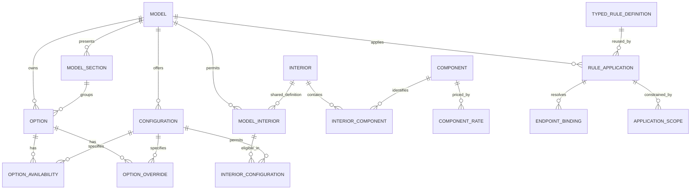

# Proposed catalog database design

**Historical, paused proposal.** Start with the [current discovery index](model-discovery.md).
This document must not drive implementation or constrain unfinished model discovery.

**Status after the behavior-first review:** this earlier cross-model proposal remains
unvalidated. The [whole Stingray schema plan](stingray-schema-plan.md) is the current
proposal for reviewing Stingray ownership; it does not approve sharing across models.
The historical proposal below is retained as reference, not implementation authority.

September 7, 2026. **Logical design for review; no DDL or migration applied.**
This translates the [complete six-model relationship map](form-relationship-map.md)
into proposed owners, keys and constraints. It supersedes the earlier
[source/schema specification](source-schema-specification.md) for the ownership
proposal only. [Schema 3](../catalog/schema.py) remains the implemented disposable
candidate; the workbook remains canonical. This proposal does not authorize an
application, source correction, merge, deployment or cutover.

## The ownership decision

Keep options owned by a model/year. Share interiors and component rates where the
source already establishes shared identity. Represent reusable rules as **typed
rule definitions with explicit model applications and endpoint bindings**. Sharing
a rule never shares its options' prices, availability or customer copy.

A definition owns the operation and complete logical membership. An application
owns the model, actual product references, scope, activity, explanation and local
precedence. Do not create an RPO inheritance tree, a generic expression language,
or implicit exceptions layered over a universal model. A rule used by only one
model uses the same structure with one application.

Amounts belong to the fact being priced: vehicle configuration, model option,
conditional total, or interior component rate. Descriptive totals from the workbook
remain evidence until reconciled; they cannot become competing editable charges.
The intended interior accounting is seat + R6X + extras, once each. That deliberately
differs from the known frozen-browser defect, which a parity adapter must retain
until a separately authorized correction.

`TYPED_RULE_DEFINITION`, `RULE_APPLICATION`, `ENDPOINT_BINDING` and
`APPLICATION_SCOPE` summarize the separate family tables below; they are not
proposals for four polymorphic catch-all tables. The diagram omits presentation,
compatibility and evidence tables for readability. No physical table-count target
is imposed.

## Identity and constraint conventions

- A stable internal ID identifies an editable entity or relationship whose identity
  must survive a label, RPO or source revision. IDs do not encode sheet, row, model
  spelling or RPO. Association rows use their composite key unless independently
  referenced. UUID versus integer is a physical implementation choice.
- `model` means a model in a model year. A unique `(year, catalog_key)` identifies
  it in authoring; the key is a stable catalog name, not the browser alias. No
  separate cross-year model hierarchy is needed by this baseline.
- Every model-owned table exposes `(id, model_id)` as a candidate key. Composite
  foreign keys keep configurations, options, model interiors and rule endpoints
  within their application's model. Shared definitions have no artificial model.
- An endpoint which permits either option or interior uses two typed nullable FKs,
  with exactly one set. An interior endpoint references `model_interior`, not an
  unrestricted shared definition. Option-only endpoints have one nonnullable FK.
  No free-form `entity_id` can bypass endpoint-kind or model validation.
- RPO is nullable and nonunique. Grand Sport's two T0E rows stay different options.
  Legacy identifiers live in a namespace/model/kind mapping, with each old identity
  resolving to one catalog entity; multiple aliases may resolve to the same entity.
- Exact decimal amounts retain unknown separately from zero. Unknown currency stays
  unknown. A future release price context can own currency once established; do not
  populate a guessed currency or repeat constant `price_basis='option'` on every
  option. Vehicle, conditional-total and component semantics are explicit below.
- Logical uniqueness means uniqueness of the complete fact, not matching prose.
  Duplicate source occurrences link to that fact through evidence and compatibility;
  conflicting or differently ordered applications are not silently collapsed.

## Product, availability and interior tables

The key column lists candidate keys in addition to the stable ID where present.
Fields listed here are business fields; import sequence and old identifiers are
excluded deliberately.

| Proposed table / grain | Key and fields it owns | References and invariants |
|---|---|---|
| `model` — one model/year | `(year, catalog_key)`; label, active, setup subtitle/eyebrow/title/description | Fold the current one-to-one setup-copy owner into this row. Source sheet names, dataset filenames and aliases move out. |
| `model_fact` — one displayed fact in a model's ordered list | `(model_id, position)`; text | Model FK; position orders actual displayed facts. |
| `configuration` — one allowed body/trim combination of a model | `(model_id, body, trim)`; display name, vehicle base amount, enabled, chooser order | Consolidate variant and membership ownership. Preserve both original active flags/orders in compatibility until their distinct effects are reconciled; see ordering below. Duplicate body/trim combinations would require evidence review before this constraint can be migrated. |
| `option` — one model's offered choice/equipment item | Stable ID; model, nullable RPO, name, description, base amount, model section, selectable, display behavior, active, choice order | No uniqueness on RPO/name/price. Base amount is the option's total before conditional/package resolution. Equipment and non-LPO options remain here, including hidden/display-only/auto-only records. |
| `option_availability` — one option/configuration status | `(option_id, configuration_id)`; status | Same-model FKs; standard/available/unavailable, nonnull. Require complete matrix at release validation; standard does not imply selected or free. |
| `option_override` — one contextual policy override | `(option_id, configuration_id)`; enabled, nullable selectable/display behavior/model section | Same-model FKs. Null means inherit; false explicitly overrides true. Disabled override rows have no effect; they do not deactivate the option. |
| `interior` — one source-established shared interior identity | Stable ID; name, material, seat code, interior code, suede/stitch/two-tone attributes | Retain the 262 existing definitions without merging on color or name. Source flags, notes and legacy total remain traceable outside charge ownership. |
| `model_interior` — one model's use of a shared interior | `(model_id, interior_id)`; enabled, model section, leaf label, choice order | Retain all 704 memberships; derive eligible trims/bodies through the following association. If source rows differ by trim, their distinct applicability/presentation must be preserved before consolidation. |
| `interior_configuration` — a membership eligible in a configuration | `(model_interior_id, configuration_id)` | Same-model FKs. Seat eligibility also compares selected seat with the definition's seat identity. Dynamic prerequisites remain typed rules, not availability columns. |
| `component` — one priced component identity | `(component_type, code)`; default label | Components distinguish seat, R6X and extras. Code alone is not unique across types and is not an option FK. |
| `component_rate` — one component amount in a model year and rate context | `(component_id, model_year, trim_context)`; exact amount | Nonnull model year matches the selected configuration's `model.year`. A distinct universal trim context supports exact-trim then universal fallback within that year only. Existing 21 rates retain their identities/amounts, scoped to the baseline model year. No duplicated amount on membership. |
| `interior_component` — one component of a shared interior | `(interior_id, component_id)`; rate context, display order, optional contextual label | Component and interior FKs. Consolidate current model-expanded memberships only when rate context, label, activity and order agree; source sharing must be proved. |
| `model_interior_component` — an explicit model-specific component difference, only if reconciliation finds one | `(model_interior_id, component_id)`; include/exclude, rate context/order/label override | Proposed conditional table, not presumed populated. Exclude cannot carry a price. A differing amount needs an explicit reviewed rate context, not a second amount owner. Do not implement this table without a demonstrated difference. |

Do not store `requires_z25`, `requires_r6x`, `included_option_id` and direct rules
as independently editable versions of the same requirement. The intended executable
owner is the typed relationship. The current flags/references remain source and
compatibility facts until compared against the direct rules for every membership.
A source-only flag must not silently become a new executable prerequisite: the
frozen browser does not read those flags. Conflicts remain unresolved review items.

## Typed rules, reuse and model applications

Use the following closed set of families. Each definition has a stable ID; each
application has its own stable ID, definition FK and model FK. Definition slots
identify a role in that rule, not a globally shared product. Bindings resolve those
roles to actual model-owned IDs; never resolve them by looking up a nonunique RPO.
Every required slot must have exactly one valid binding before release.

A shared definition also owns a descriptive relationship name and the business
meaning of each endpoint/member role. For example, the SPZ/SPY definition's roles
are black wheel locks and black lug nuts; each application binds its actual local
option IDs. These role descriptions belong only to this relationship, are not
lookup keys, and do not create another product catalog. Sharing only an operation
enum (such as all `requires` rules) would not establish shared business meaning
and is not sufficient to consolidate definitions. Evidence review establishes
binding equivalence; foreign keys establish type and model integrity.

| Family: proposed definition and application tables | Definition owns | Application owns / associated rows |
|---|---|---|
| `direct_rule_definition`, `direct_rule_application` | Effect requires/includes/excludes; optional replacement action; permitted source/target kinds | Source and target typed FKs, enabled state, scope, explanation, evaluation order. Replacement action is allowed only with the mapped exclusion semantics. No transitive replacement inference. |
| `group_rule_definition`, `group_rule_slot`, `group_rule_application`, `group_rule_binding` | Requires-any or excludes-any; complete set of member slots and permitted kinds | Source endpoint; each `(application, slot)` binds one target, activity and explanation order; group label/explanation, scope, activity. Multiple prerequisite groups remain separate AND obligations, with OR inside each. |
| `exclusive_definition`, `exclusive_slot`, `exclusive_application`, `exclusive_binding` | At-most-one or exactly-one; complete option-member slots | Each slot binds a local option with activity/order; application label, activity and evaluation order. Multiple groups may reference an option; no invented one-group-per-option constraint. |
| `conditional_price_definition`, `conditional_price_application` | Conditional total-override operation and endpoint kinds | Condition option/interior, target option, exact total amount, scope, evaluation order. Price belongs to this contextual relationship; shared mechanics do not force shared amounts. |
| `default_definition`, `default_application` | One of the four mapped condition kinds and explicit/automatic selection semantics | Target option; condition RPO text, section FK or triggering option as required; resolved-target-section mode, priority, tie-break order, scope, display behavior and activity. CHECK condition fields against kind. The RPO condition intentionally tests all selected choices with that code. |
| `color_definition`, `color_application` | Shared interior FK, exterior/added-option role meanings and the operation interior AND explicitly selected exterior adds required option | `(definition_id, model_id)`; matching model-interior FK, exterior option FK and added option FK, application order. Definition identity represents a reviewed complete combination, not just an interior; no uniqueness on interior alone. Distinct color combinations remain distinct definitions. |
| `replacement_permission` | No shared definition required for five model-specific permissions | `(model_id, source_option_id, target_option_id, method)`; code evidence. Only the five approved Z06 includes-closure derivations; method is a closed supported value. |

Each family's scope uses an application-axis row keyed by `(application_id, axis)`
and ordered token rows keyed by `(scope_id, position)`. Axis is body/trim/variant;
variant tokens additionally reference same-model configurations. A matcher profile
on the application distinguishes direct exact-body matching, generator token
matching and browser token matching where each stage uses them. Preserve the raw
scope expression and stage-specific interpretation in compatibility. Do not
reinterpret `A|*`, whitespace, blank or whole `*` as identical across consumers.
For the intended new evaluator, explicit configuration membership is preferable
only after its equivalence or intentional differences have been demonstrated.

Applications own explanatory copy because matching signatures explicitly omitted
prose; no evidence supports merging that copy. Definitions own complete logical
member sets; member order remains local because, for example, Stingray's R88 order
differs from other models. Application bindings may change local endpoints but may
not omit required slots or add members to a shared definition silently.

**Authoring a difference:** create a separate definition with the full member set
and bind the affected model to it. Do not use implicit base-set inheritance or
add/remove patches. A shared definition edit has an explicit impact list of all
applications; a local change forks the definition. This duplicates genuinely
different logical sets while keeping identical reviewed sets reusable. No generic
shared-set subsystem is needed before a concrete independently reused set is found.

### Concrete records the proposal must represent

- **SPZ requires SPY:** propose one requires definition and six applications. Each
  binds that model's SPZ and SPY option IDs and retains its own scope/explanation.
  The six source anchors in the [map](form-relationship-map.md#accessories) prove
  direction; full application fields remain subject to reconciliation before sharing.
- **CF8 stripe exclusion:** retain separate complete definitions for differing
  sets. Stingray/Z06's 13-code sets are sharing candidates; Grand Sport's center
  stripes and Grand Sport X's DTC/DUW differences remain explicit. Equal code sets
  still require binding and full-field review before a shared edit owner is accepted.
- **SFE exclusions:** retain SPY in all six contexts, ROY/ROZ/STZ only where mapped,
  and SU1 only in ZR1/ZR1X. A common accessory category grants no extra exclusions.
- **Color source `color_overrides!2`:** one proposed definition for the complete
  combination, two applications: Stingray and Grand Sport, each binding its G26,
  D30 and eligible `1LT_AQ9_HUQ` membership. The 831 source combinations account for
  1,528 applications; Grand Sport X's separate source is not merged merely because
  a signature matches. Source counts are reconciliation anchors, not future keys.
- **Z51/J55/FE4/TVS:** option rows own product facts. Separate rules say Z51 includes
  J55 and FE4 requires Z51; a contextual total-price row makes TVS zero when Z51 is
  selected. None of these relations transfers option ownership to the Z51 RPO.

The 801 cross-model signatures remain review candidates. This proposal accepts
no automatic deduplication and does not declare their prices, copy or lifecycle shared.

## Price resolution and one charge owner

Ordinary conditional prices retain first-match precedence, including known zero.
Package pricing needs an explicit relationship instead of reconstructing ownership
from coincidentally positive differing totals and exclusive groups on every read.
Propose `package_price` (model, target option, scope, activity, evaluation order)
and `package_price_total` keyed by `(package_price_id, condition_option_id)`, owning
the authored conditional total for that component choice. The condition must bind
a member of the identified single-choice `exclusive_application`; store that group
FK on `package_price`. Competing applicable schedules require explicit precedence.

For a reviewed package schedule, derive the minimum total as package base and each
nonnegative total-minus-minimum as component delta. **Do not store editable base,
delta and total simultaneously.** A source price row maps either to an ordinary
conditional total or to a package total, never to both active owners. Preserve the
existing precedence: component delta, selected package minimum, ordinary conditional
total, option base. Identifying which of the 297 rows belongs to a package requires
per-model reconciliation with the frozen inference; no classification is invented
by this proposal. Until that is done, retain current behavior in compatibility.

For interiors, resolve each component rate once using the selected configuration's
model year and the component's rate context. Look up the exact trim in that year,
then the universal trim in the same year; never fall back to another model year.
A missing rate remains unresolved and blocks acceptance rather than borrowing an
older charge. Shared interior/component memberships supply the component and trim
context; they do not pin a year or an amount. Thus a reused component code can have
separate 2027 and 2028 rate rows without overwriting either year's charge, while
models in the same year can still share an evidenced rate. These years illustrate
the key's behavior, not an accepted later-year price or source fact.

Option selection and component itemization may describe the same physical seat or
R6X charge; propose
`interior_charge_binding` keyed by `(model_interior_id, component_id)` with a
same-model option FK when a component represents that option's charge. The binding
identifies one line-item owner for the resolved build; it is not an inclusion rule
or a second price. Reconcile component rates with option/conditional amounts in
each context before assigning the owner. A conflict blocks acceptance; do not
arbitrarily prefer one source. Extras without a corresponding option remain
component-owned. Any residual interior amount needs an independently evidenced
charge, not a balancing value invented to make totals pass.

`PriceRef`'s combined seat/R6X rates and the stored interior amount remain evidence
for this reconciliation. The AE4 seat charge of 595, R6X and extras must all survive
once; zero-seat AH2 cases must not acquire a new charge. The [R6X review](model-rule-review.md#executed-r6x-review)
provides the 180 body/interior cases and 96 lifecycle checks for eventual correction
validation. The design changes no amount today and does not claim the final
charge bindings or package schedules have already been reconciled.

## Presentation and ordering have specific owners

| Proposed table / key | Owned meaning and constraints |
|---|---|
| `section` / stable ID and catalog key | Shared name, selection mode, required behavior and standard behavior. These are selection semantics, not only headings. |
| `model_section` / `(model_id, section_id)` | Label override, step FK, display behavior/order, equipment/auto-added bucket flags and group type, activity. Options and contextual overrides reference this same-model application. |
| `model_step` / `(model_id, step_key)` | Label, navigation order, activity, navigable. Standard equipment can remain nonnavigable; preserve three code-supplied buckets as evidenced policy. |
| `context_section` / `(model_id, context_type)` | Body/trim chooser mode, required/standard behavior, name, placement and step FK. Body/trim values derive from configurations; no independently editable duplicate choice list. |
| `summary_section` / `(model_id, section_key)` | Summary label, order, activity. |
| `step_summary` / `step_id` | Same-model summary-section FK and activity. One destination per step. |
| `context_copy` / `(model_id, context_type, value, body_scope)` | Tooltip and activity; validate values against configurations. Body-specific copy precedes general copy. Use an explicit general-scope sentinel, not nullable-key uniqueness assumptions. |
| `interior_navigation_node` / stable ID | Model, parent FK, sibling order, role and label; unique `(model_id, parent_id, role, label)` with explicit root handling. Acyclic same-model tree. Label/order belong to the path node once, not every descendant membership. |
| `interior_navigation_member` / `(node_id, model_interior_id)` | Membership and leaf order; same-model references. Do not duplicate path strings or ancestor labels as editable fields. |
| Typed asset bindings / target + assignment context | Model, option, model-interior or derived context target; image/hover URLs, alt, fit, position and activity. Use target-specific FKs. Explicit-model binding precedes an evidenced shared assignment. Shared asset identity does not imply shared option identity; do not use RPO as asset lookup identity. |

One `choice_order` means order within the option's resolved section. One sibling
order means order within an interior navigation parent. One evaluation order means
first/last-match precedence within a rule family. Default priority is a separate
business rank with deterministic tie-break order. Model publication order belongs
to publication configuration. These orders cannot be replaced by a global `sequence`.

The current candidate's `variant.display_order`, `membership_order` and `sequence`
are not three new authoring fields. The generator orders variants by membership
order, emits display order, and falls back to source order in other paths. Keep
those original values in the frozen compatibility projection until actual chooser
ordering is reconciled. The proposed configuration owns one chooser order; if two
independently editable product views need different order, attach the second to
that named view rather than copying the workbook columns. Apply the same rule to
interior group/material/choice/reference orders: node/leaf positions own actual
navigation; emitted legacy order fields and tie breaks remain compatibility data
until their consumer effects are checked. Preserve all values in the meantime.

## Evidence, compatibility and publication are separate concerns

Retain source document identity/hash/revision, sheets/rows/cells, source routing,
nonapplicability/dispositions, original notes and code revision/symbol evidence.
Evidence links identify the exact typed fact and, for shared rules, its application
or binding where appropriate. Links must validate the destination (typed link
tables or equivalent enforced constraints); a free-text table name and ID alone
are not referential integrity. Repeated original facts are evidence, not additional
editable product records. Six phrase-map rows and the empty exceptions sheet stay
accounted for without becoming active rules.

`legacy_identity` maps `(namespace, model, kind, legacy_key)` to a typed owner.
`legacy_projection` retains emitted metadata, original ordering, raw scopes, dormant
flags and source values needed to reproduce the frozen contract. It is migration
compatibility, not an authoring surface or a generic business-property store.
Keep the frozen source and contract artifacts as the baseline; document which
projection fields are still consumed before removing any.

Publication configuration owns included models, aliases, dataset paths, default
model and published order. Use one default-model reference per publication instead
of editable default flags on both model and publication rows. Expected variant
counts are release validation expectations, not model product attributes. Resolved
builds, equipment lists, prices and submission payloads derive from catalog facts
and selected/automatic/default state; do not create parallel editable output tables.
Future release snapshots, intake acceptance/history, backup and visualizer scenes
remain in the roadmap. Current image bindings do not settle the future scene schema.

## Traceability and implementation boundary

All rows of the relationship register have an owner above: model/registry and
configurations; every option/status/override; sections and all presentation routes;
interior eligibility, requirements, components and navigation; direct/grouped/
exclusive/default/color rules and scopes; conditional/package pricing; assets;
provenance; and derived build outputs. The [blueprint source-family map](workbook-translation-blueprint.md#complete-source-family-map)
continues to identify their current candidate destinations. No imported family is
dropped because it is inactive, suppressed, model-specific or absent from the ERD.

| Design decision proposed now | Evidence still needed before migration/behavior change |
|---|---|
| Model-owned options; shared interior identities and rates | Reconcile all source identities/values, 7,448 availability pairs, 704 memberships and contextual overrides against the frozen workbook. Validate proposed configuration/membership unique keys before collapsing rows. |
| Typed shared rules with explicit applications; complete separate sets for differences | Review all fields, bindings, prose, order, activity, scope and surrounding rules before accepting each shared owner. Preserve unmatched records and the documented stripe/accessory differences. |
| Component/package totals have one owner | Classify package schedules; reconcile every interior component/option charge binding and stored amount. Preserve intentional conflicts as review facts. R6X correction needs its own implementation authorization. |
| Requirements owned by executable relationships | Reconcile dormant required/included flags with direct rules; distinguish source-only facts from actual prerequisites. No inferred new behavior. |
| One purposeful order per view or evaluation | Compare source/emitted/consumer ordering, including duplicate-RPO selection, multi-exclusive membership and representative-choice lookups; do not encode incidental index behavior as a database constraint. |
| Scope semantics remain explicit | Compare exact/direct, generator-token and browser-token behavior; no silent normalization. |

A later authorized implementation should first translate a bounded set into a
new disposable candidate and produce added/changed/removed/unresolved facts with
source references. It must retain frozen six-model contract/registry parity for
structural changes and separately classify intentional corrections. Constraint
checks must include cross-model endpoints, missing bindings, wrong endpoint kinds,
null versus false/zero, member order and scope interpretation. Component-rate
checks must cover one code with different amounts in two years, same-year universal
trim fallback, and a missing-year rate that cannot borrow another year's amount.
Affected execution checks include OR groups, replacement direction, defaults, package precedence,
color additions after closure, and interior totals; broad counts alone are insufficient.

This task validates the logical proposal by reviewing it against the complete map,
the current schema and contract consumer. No migration, automated runtime tests,
new source audit, exhaustive selection testing or drawDB refresh was performed.
The current drawDB SQL continues to describe schema 3, not this proposal.
