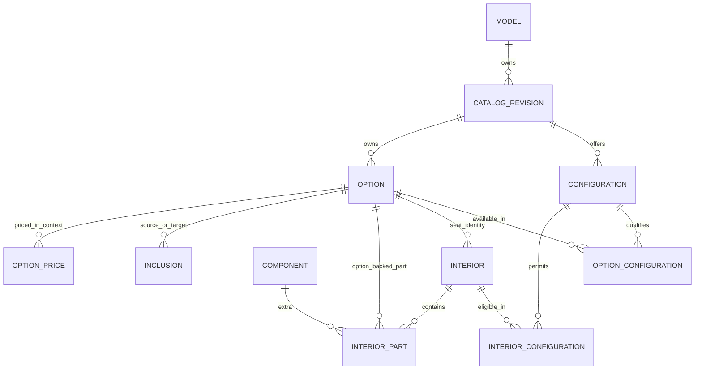

# Stingray schema plan

**September 9 review update:** the [Stingray](stingray-structured.md#8-decision-overlay-source-baseline-and-target-remain-separate) and [Grand Sport](grand-sport-structured.md#8-decision-overlay-source-baseline-and-target-remain-separate) owner decisions supersede conflicting behavior/price proposals below. This earlier schema proposal remains paused; no schema implementation is authorized by those decisions.

September 7, 2026. **Complete logical model proposed for review.** This plan follows
[Stingray's reviewed relationship analysis](stingray-behavior.md), including the
accepted DUW removal, DTC stripe inclusion and SAI sill-plate addition. It defines
the whole lane before database implementation. No DDL, workbook edit, application
change, price correction or cutover is performed here.

The recommendation is a model-owned catalog with explicit configuration
applicability, typed relationships and one owner for each charge. A selectable
option, its supplied equipment and its calculated line item are different things.
For example, Z51 owns its package price, its inclusion relationships supply J55 and
FE3, and the resolved build determines which supplied equipment survives FE4 or an
aero deletion. Those results are not additional editable catalog records.

This is the proposed Stingray design to review instead of applying the earlier
[unvalidated cross-model proposal](proposed-database-design.md). The same table
structure is a candidate for subsequent model lanes, subject to their behavior
reviews. The [Grand Sport analysis](grand-sport-behavior.md#12-coverage-unresolved-facts-and-implications-for-the-schema-proposal)
identifies a missing conditional prerequisite and unresolved package pricing;
implementation remains paused while the remaining lanes are analyzed. This task
approves no shared product identities, rates or rule definitions across models. Schema 3 and its
[drawDB diagram](drawdb.md) remain the earlier disposable implementation.

## 1. Foundations: identity, configuration and scope

### Revision and key conventions

`model` identifies the lane (Stingray). `catalog_revision` identifies one complete
snapshot of that model in one model year. Revision **R** below therefore fixes both
model and year. Rows are editable while draft and immutable when released. An immutable release contains only released revisions. A later
revision preserves stable local IDs for continuing concepts; changing an RPO does
not itself prove identity continuity. DTC receives its own identity; it is not an
alias for DUW.

In every table below, keys and foreign keys include R unless explicitly global.
For example, `(R, option_id, configuration_id)` references `(R, option_id)` and
`(R, configuration_id)`. This prevents cross-model, cross-year and cross-revision
relationships. `id` means a stable local identifier; its eventual integer/UUID
encoding is not a business decision. Fields listed with a key are functionally
dependent on that complete key. Association tables do not need a second ID unless
another fact must reference the association independently.

- RPO and display name are nullable/nonunique or nonunique, respectively; neither
  is a product key. Uncoded equipment keeps its own option identity.
- Exact amounts use decimal arithmetic. Zero means a known zero charge. A missing
  amount means unknown, never free. `price_basis` identifies the frozen workbook
  basis, its units and unresolved currency; new guide amounts cannot silently mix
  with it. A priced public release requires a resolved basis and all needed rates.
- Null in a contextual override means inherit; false means explicitly false.
  No other table uses null as an implicit wildcard.
- Body/trim applicability is an explicit set of configurations. Each rule family
  has its own `*_configuration` association keyed `(R, rule_id, configuration_id)`.
  All six means six rows; an empty set means no applicability, not all.
- Original scope strings, ordering and inactive rows remain source evidence. The
  translation must compare each family's effective configuration set against its
  frozen consumer, including availability-dependent rule applicability. Raw
  `*`, blank and pipe syntax do not become the new authoring language.

### Product and configuration owners

| Table | Grain / key | Owned fields and constraints |
|---|---|---|
| `model` | Global `model_id`; unique catalog key | Lane name. No shared option hierarchy. |
| `catalog_revision` | Global revision ID; unique `(model_id, model_year, revision_number)` | Draft/released status, prior revision FK, price-basis FK, model setup copy. Prior revision belongs to the same lane; no automatic cross-year fallback. |
| `price_basis` | Global basis ID | Source basis label, exact unit semantics, nullable currency and resolution state. The legacy numeric basis is identifiable even while currency is unresolved. |
| `configuration` | `(R, id)`; unique `(R, body, trim)` | Coupe/convertible plus 1LT/2LT/3LT, enabled, chooser order, vehicle base amount. Six current combinations; no Cartesian expansion into nonexistent configurations. |
| `option` | `(R, id)` | RPO, name, customer description, lifecycle, base amount, section FK, choice order, selectable flag, display role. Covers paint, purchases, packages, auto-only items and coded/uncoded equipment. |
| `option_configuration` | `(R, option_id, configuration_id)` | Explicit standard/available/unavailable status. Complete matrix for catalog options, including inactive options. Standard status alone neither selects nor zero-prices an item. |
| `option_override` | `(R, option_id, configuration_id)` | Enabled override and nullable selectable/display-role/section overrides. Referenced section is in R. Disabled override has no effect. No duplicate price field here. |
| `model_fact` | `(R, position)` | Ordered setup facts/copy, separate from configuration eligibility. |

**Starting records.** Configuration prices are 73,495 / 80,595 / 85,245 for coupe
1LT/2LT/3LT and 80,495 / 87,595 / 92,245 for convertible. These are the workbook's
base amounts, with its existing destination treatment; no second destination
charge is added. Sources: `variant_master!A2:H7`, `model_variants!A14:E19` and
[analysis §2](stingray-behavior.md#2-model-body-and-trim-establish-the-starting-configuration).
Body and trim choosers derive their values from these records.

UQT keeps one option with base amount 1,495. Its configuration statuses and display
role make it a purchase at 1LT and supplied/display-only equipment at 2LT/3LT.
There is no duplicate UQT product or fake zero base price for those trims. B6P and
ZZ3 remain separate body-qualified offerings. Body-specific finished surfaces
belong to contextual content (§5), not extra invented option identities.

The diagram shows principal ownership only. The tables below complete rules,
pricing, presentation and evidence; diagram edges do not authorize cascade edits.

## 2. Interiors: preserve complete choices, price the parts once

The 130 eligible leaves remain the selectable identities. They are not reconstructed
from an unrestricted color × seat × extras cross product. Trim eligibility, seat
identity and exact part membership distinguish leaves with the same interior code.
Navigation labels organize those leaves but do not define their business identity.

| Table | Grain / key | Owned fields and constraints |
|---|---|---|
| `interior` | `(R, id)` | Interior code, seat-option FK, material/color description, leaf label, enabled. No editable total or duplicate seat/R6X price. |
| `interior_configuration` | `(R, interior_id, configuration_id)` | Explicit eligibility. Seat must be permitted in that configuration. Dynamic requirements are separate relationships. |
| `interior_selection_policy` | `R` (one row per revision, FK to `catalog_revision`) | Minimum and maximum selected interiors, auto-select-sole-eligible flag, invalid-selection action, requirement label/detail and step FK in R. Stingray uses minimum = maximum = 1, auto-select = true, invalid action = clear, label `Interior Color`, step `base_interior`. This owns interior selection cardinality; option-only choice groups do not. |
| `interior_part` | `(R, interior_id, part_key)` | Exactly one of option FK or component FK; role, line label override and itemization order. Unique target per interior. No amount. Seat is represented by `interior.seat_option_id`, not repeated as a part. |
| `component` | `(R, id)`; unique `(R, component_kind, code)` | Identity and label of a non-option extra, such as N26, 38S or TU7. Not a second seat/R6X option catalog. |
| `component_rate` | `(R, component_id, trim_context)` | Exact amount. `trim_context` is 1LT/2LT/3LT or explicit `all`; exact trim wins, then `all` in the same R. Missing rate is unresolved. R fixes model year, so no previous-year or other-model lookup. |

The interior policy applies to every configuration in R. Its candidate set is the
enabled interiors permitted by `interior_configuration`, the selected seat and
applicable dynamic requirements. After a context or seat change, clear an invalid
selection and auto-select only if exactly one eligible interior remains. With
multiple candidates, leave it unset for the user; with no candidates, leave it
unset and report that no compatible choice exists. Neither case relaxes the
minimum: an unset interior blocks submission even if every option group is filled.
At most one interior can be selected, and a submitted selection must be eligible.
The policy supplies the requirement copy and navigation target, so this behavior
does not become another hard-coded consumer rule. Evidence: frozen
`missingRequirementDetails()` and `reconcileInteriorSelection()` at revision
`4fe92a4f078370c478f18484cad31bdafe58ad43`.

The selected seat is already an option charge, even before an interior is chosen.
R6X is an option-backed interior part at 995. N26, stitching and TU7 are
component-backed parts priced from their rates. The part membership is the sole
owner of interior-carried R6X; any equivalent frozen inclusion row becomes
corroborating evidence, not a second executable inclusion. Identity-only zero-cost
source components map to interior attributes when they carry no separate part;
that classification must be recorded per source membership during translation.

This intentionally chooses **option-owned seat/R6X prices and component-owned
extra prices**. `PriceRef` seat/R6X and combined rates remain reconciliation evidence;
they are not another editable tariff for the same purchase. A disagreement blocks
translation of that charge instead of being resolved by matching a stored total.
All 197 source component memberships require a disposition, not 197 arbitrary
new active part rows. No membership translation is claimed implemented here.

Concrete leaves:

| Leaf | Stored relationships | Derived seat/interior subtotal |
|---|---|---:|
| `2LT_AH2_HU7_N26_TU7` | Seat AH2; parts N26 and TU7 | 1,695 + 695 + 595 = 2,985 |
| `2LT_AE4_HU7_N26` | Seat AE4; part N26; no TU7 | 2,095 + 695 = 2,790 |
| `3LT_R6X_AE4_HXO_N26_38S` | Seat AE4; option part R6X; component parts N26 and 38S | 595 + 995 + 695 + 495 = 2,780 |

The third subtotal deliberately represents the established additive requirement;
the frozen subtotal is 2,185. All four known AE4/R6X defects remain classified as
intentional corrections pending implementation, not passing parity. AH2's zero
3LT seat charge remains zero. No residual charge is invented to balance an interior.
Source: [analysis §7](stingray-behavior.md#7-complete-interior-choices-components-and-belts),
`interior_components!A2:K198`, `PriceRef!A2:D22`, `model_interior_scope!A444:R573`.

## 3. Relationships: requirements, equipment, conflicts and defaults

These are separate typed families, with direct model-owned endpoints. There is
no shared-definition/slot/application layer to populate before Stingray can be
authored. A later model uses the same families with its own records. Cross-model
sharing would require a separate evidence-backed decision.

Every family row has enabled state, explanation, evidence-set FK and a deterministic
evaluation order unique within that family and R. Child members retain enabled
state and explanation order where the source uses them; disabled members are
evidence, not active participants. It has explicit configuration membership as
specified in §1. A source endpoint allowing option or interior uses two typed FKs
with an exactly-one CHECK. Target options never use an unvalidated string RPO.
Optional additional condition fields listed below are AND conditions, not scripts.
Selection-state tests distinguish explicit user choices from resolved choices
(explicit + automatic + defaults). This distinction is needed for package alternatives
and paint/belt combination overrides.

| Family and associated tables | Grain and owned meaning | Key constraints / Stingray example |
|---|---|---|
| `requirement`, `requirement_member` | Requirement ID; source endpoint; one or more target options, ANY within one requirement. Independent requirements are ANDed. Fields: source-state test and loss action (`remove_dependent` or `retain_invalid`). | Member key `(R, requirement_id, target_option_id)` with explanation order. A direct prerequisite has one member. FE4 requires Z51; 5V7 requires any allowed wing. No duplicate direct-AND rules for that same ANY group. |
| `inclusion` | Inclusion ID; source endpoint, target option, optional guard-option FK, peer policy (`locked` or `yield_to_explicit`), acquisition policy (`absorb_existing_purchase`), source-state test. | Source + guard both required if guard exists. Z51 includes J55; 5ZU includes ZF1 only with Z51 in the compatibility interpretation. Option-backed interior parts do not also acquire through inclusion. Inclusion itself owns no amount. |
| `conflict`, `conflict_member` | Conflict ID; source endpoint and excluded options; on source acquisition (`refuse` or `remove_members`), on member acquisition (`refuse` or `remove_source`). | Member key `(R, conflict_id, target_option_id)` and explanation order. Keep complete local sets and their direction; no single universal stripe set. Explicit replacement rows use these policies. |
| `choice_group`, `choice_group_member` | Group ID; minimum 0/1, maximum one or explicitly unbounded, peer action. Membership is either all choices in one effective section or an explicit member set. | CHECK exactly one membership mode. Section mode derives members after configuration overrides; explicit mode uses `(R, group_id, option_id)`. Overlapping groups allowed. Defaults own restoration targets; a group does not duplicate them. No separate conflicting cardinality field on section. |
| `default_choice` | Default ID; target option, condition kind, priority, tie-break order; typed section/trigger fields required by kind. | Closed kinds: always, unless option-set present, unless section occupied, when trigger present unless section occupied. `default_absence_member` lists option IDs for the second kind. Compile legacy RPO tests into their complete matching option set; never pick an arbitrary representative. |
| `combination_addition` | ID; interior FK + explicitly selected option FK → added option FK. | Unique `(R, interior_id, selected_option_id, added_option_id)`. All 137 paint and 132 belt conditions target D30. Hard prohibitions are conflicts, not paid combinations. Multiple causes produce one target. |

**Scopes must preserve observed applicability.** The frozen direct matcher ignores
some relationships when a referenced option is unavailable, with an auto-only target
exception. BCP→ZZ3 therefore applies on convertible, despite the workbook's blank
body scope, and does not require ZZ3 on coupe. The new requirement stores the
explicit convertible configuration set. Translation must use the effective
consumer behavior, not blindly expand the raw blank scope to six configurations.
Changing option availability later requires reviewing affected scopes; silent
recomputation would move ownership back into accidental consumer behavior.

**Group policies are business data.** DPB→PDV removes the stripe, while PCX→DPB
is refused. That cannot be represented by an unordered incompatible pair alone.
The proposed conflict policies preserve those directions. Each mapped conflict
needs both acquisition directions classified; this plan does not claim that every
unexecuted pair already has a verified interaction classification.

**Exactly one belt is separate from which belt is supplied.** H8T supplies 3A9 with
an inclusion that yields to explicit alternatives and a zero contextual price.
HAG/HVZ additionally have hard conflicts with their five prohibited belts. When
no qualifying belt remains, the 719 default fills the group. An H8T→HTE interior
change can retain paid 3F9 while removing D30; HAG→HVZ exchanges automatic belts.
Sources: `rule_mapping!A128:H179`, `price_rules!A32:H53`, `color_overrides`, and
[analysis §7](stingray-behavior.md#7-complete-interior-choices-components-and-belts).

## 4. Prices and resolved selection state

| Price owner | Key / resolution | Meaning |
|---|---|---|
| `configuration.base_amount` | Configuration | Vehicle starting amount on the identified basis. |
| `option.base_amount` | Option | Default purchase amount. Lifecycle or standard status does not overwrite it. |
| `option_price` | `(R, id)` plus family configuration membership | Target option FK; optional condition option OR interior FK (at most one), state test, exact total and evaluation order. No condition means a configuration-specific amount, such as seat pricing. First applicable row wins; zero is a valid override. |
| `component_rate.amount` | Component + trim context in R | Non-option interior extras only. No rates on part membership or navigation nodes. |

Option-price conditions use resolved state where package inclusion requires it;
any frozen explicit-only condition must retain that state test. No executable row
may have an unknown amount. An unresolved new offering can exist in a draft with
missing price, but is not a zero-priced purchasable release item.

There is no demonstrated Stingray need for package-minimum/component-delta price
schedules. PCX, PDV, PCU, PEF, PDY and SBT are options at their own amounts;
inclusions supply other options, and contextual rows zero those supplied charges.
BCP has 695 base and a 595 contextual total with the appropriate B6P/ZZ3/body
condition. TVS has a zero contextual total with Z51. Do not import the broader
proposal's inferred package schedule into this lane.

### One build, multiple causes, one charge per owner

The evaluator keeps explicit selections, defaults, automatic acquisition causes,
interior selection and suppressed equipment separately. These are **derived runtime
state**, not editable product tables. A transient option cause key is
`(option_id, originating_relationship_or_part)`; the emitted/charged owner key is
`option_id`. Component charges use the selected interior and component ID. The
seat line can be displayed under interior without changing its option charge owner.

- Two D30 combination causes yield one D30 charge. Remove one cause: retain D30.
  Remove the last cause: remove D30 unless another valid cause remains.
- BCP and B6P can both supply D3V. Removing B6P retains lighting through BCP and
  removes SL9 if no cause remains; BCP returns from 595 to 695.
- PCX's 5DG inclusion yields to explicit 5DO. PCX retains 4,595, 5DO costs 4,395,
  and suppressed 5DG produces no additional charge. There is no inferred credit.
- PEF absorbs a previously purchased CAV. That purchase intent is consumed, not
  saved to reappear when PEF is removed. The same applies to PCU/STI, PDY/RYT
  and SBT/SC7. Mere cause reference counting without acquisition history would
  incorrectly restore those purchases.
- Standard display-only equipment contributes no separate purchase line. UQT's
  2LT stored price is still 1,495. Default selectable options use their resolved
  price; display-only standard equipment is a different role.

Recommended event sequence, to be verified when an evaluator is implemented:

1. Resolve the configuration, option overrides and applicability. Body/trim change
   resets choices; apply `interior_selection_policy` to clear an incompatible
   interior and auto-select a sole eligible candidate.
2. Evaluate the attempted choice's prerequisites/conflicts. Refuse or replace as
   the applicable policies direct; record explicit intent only when accepted.
3. Reconcile removals, interior parts, inclusions, paid-peer suppression and
   combination causes. Consume standalone intent where inclusion absorbs it.
4. Restore viable defaults and required-group fallbacks, including a sole selectable
   standard choice; repeat affected resolution
   until stable. Detect cycles/contradictions rather than arbitrarily dropping rows.
5. Resolve charges once, then report missing prerequisites and required choices,
   including the minimum interior selection from `interior_selection_policy`.
   A `retain_invalid` requirement can keep 5ZU charged after incompatible paint;
   submission remains blocked. That is distinct from removing FE4 after Z51 loss.
6. Produce recap, order codes and visual inputs from the same resolved result.

This is a target evaluator contract, not proof that this sequence reproduces every
legacy branch. The frozen `reconcileSelections`, `computeAutoAdded`,
`reconcileInteriorSelection`, `lineItems` and `missingRequired` remain comparison
paths. No database FK cascade should implement a customer's selection transition.

## 5. Equipment and physical content

The static standard-equipment view derives from configuration statuses. The
resolved build view includes defaults, purchased and supplied equipment and explicit
substitutions. These two views have different names and contracts. The legacy
standard-equipment card currently does not remove replaced standard equipment.

| Table | Grain / key | Ownership |
|---|---|---|
| `equipment_substitution` | `(R, id)` plus configuration membership | Trigger option, optional guard option, removed equipment option, replacement option FK where present. Affects installed-equipment output; does not select or charge the replacement. Inclusion/default ownership supplies it separately. |
| `content_effect` | `(R, id)` plus configuration membership | Source option OR interior FK; optional guard option; named content aspect, replacement/additive description, precedence and evidence. Descriptive, no price, eligibility or invented RPO. |

Proposed installed-equipment substitutions include Z51's JL9→J55, G0J→G96,
M1L→M1N and XFN→QTU. Their guide disclosures are in analysis §8. The explicit
selection replacements FE1/FE2 and FE3/FE4 already belong to relationship/group
policies. An equipment substitution never duplicates those purchase transitions.
Aero deletions must await the order-code decisions in §9; missing replacement
means remove-only, not a fabricated delete RPO.

Content effects can describe WKR's high-wing cover version, B6P's carbon trim,
ZZ3's window, the accessory wheels' included hardware, SBT's second roof,
body-specific accent surfaces and HUB/HUC suede substitution. They let the catalog
retain fulfillment meaning without claiming that the form already models separate
physical parts. A content-effect row is not a visual asset or a new selectable card.
Conflicting replacement descriptions for the same aspect need explicit precedence
or a review decision. Their detailed authoring vocabulary remains to be reviewed.

## 6. Presentation and visualizer contract

| Table | Grain / key | Owned meaning |
|---|---|---|
| `section` | `(R, id)` | Label, display order, step FK, display/equipment bucket role, optional primary choice-group FK. Selection cardinality lives on the group. |
| `step` | `(R, id)` | Label, order, navigable flag; includes the three code-supplied equipment buckets with code evidence. |
| `summary_section`, `step_summary` | Section ID; `(R, step_id)` mapping | Recap heading/order and one summary destination per step. |
| `context_control`, `context_copy` | `(R, axis)`; `(R, axis, value, body_context)` | Body/trim chooser placement/required behavior; tooltip text. Explicit `all` body context supports general copy, overridden by exact body. Values must exist in configurations. |
| `interior_node`, `interior_node_member` | Node ID; `(R, node_id, interior_id)` | Acyclic tree, parent FK, role/label and sibling order; leaf membership/order. No duplicated parent labels on each interior. |
| `asset`, `asset_binding` | Global asset ID; binding ID in R | Immutable asset URI/hash and media metadata; typed target (option, interior, configuration or context-control value), image/hover role, alt/fit/position, precedence. Exactly one valid target; every non-global FK is in R. Multiple bindings for the same target/role use unique precedence. |
| `visual_scene`, `visual_layer`, `visual_binding`, `visual_binding_option` | Scene ID; `(R, scene_id, layer_key)`; binding ID; `(R, binding_id, option_id)` | Scene/view and ordered layers; binding references asset and layer, optional interior/configuration FKs and required option members, all supplied conditions ANDed. At least one condition or explicit fallback marker; unique precedence within layer. Option members test resolved equipment, allowing paint + roof + body combinations. |

These are logical visualizer owners, not a claim that the unprocessed `.psb` assets
have been inspected or assigned. No scene names, rendering technology or image
coverage is invented. A missing asset must produce an explicit missing/fallback
visual result, never alter product availability. Physical content can be bound to
a visual later using the same underlying conditions; the two do not imply equality.

One option-choice order controls its position in the effective section. Node
sibling order controls navigation. Rule evaluation order controls behavior.
Summary and visual layer order each belong to their view. A global source-row
sequence cannot replace these distinct purposes; original tie-break values stay
in compatibility evidence until their consumer effects are reconciled.

## 7. Provenance, intake decisions and releases

| Table | Grain / key | Owned meaning / integrity |
|---|---|---|
| `source_document` | Global ID; unique content hash | Original path/name, supplied revision/date if known, acquisition metadata. Original bytes remain unchanged and Git-ignored. |
| `source_anchor` | Global ID; document + locator + fragment key | Sheet/cell/range or code commit/symbol, raw text/rich-text representation and source value. Repeated occurrences remain distinct anchors. |
| `evidence_set`, `evidence_member` | Global set ID; `(set_id, anchor_id)` | Each authored product, applicability, part, rate, relationship and presentation fact row has a real FK to its evidence set, whose members reference anchors. No free-text table/ID link is trusted as referential integrity. |
| `review_decision` | Global decision ID | Decision text/date/authority, evidence set, accepted/proposed/unresolved state and intent (parity/correction). Relevant typed fact rows hold a nullable decision FK. |
| `source_disposition` | `(R, anchor_id, fact_fragment)` | Added/changed/removed/unchanged/ambiguous/conflicting/accounted-as-component classification, explanation and decision FK. It accounts for source coverage without acting as an editable price/rule store. |
| `legacy_option_identity`, `legacy_interior_identity`, `legacy_configuration_identity` | `(R, namespace, legacy_key)` | Typed target FK in R. Add the same typed mapping pattern for other exported entity kinds when needed; no RPO lookup. |
| `release` | Global ID | Immutable manifest/hash, creation time and artifact references. |
| `release_model` | `(release_id, model_id)` | Exactly one released revision per lane; alias, dataset path, publication order. Release has one default-model FK constrained to its membership. |

`ambiguous` means the source meaning cannot yet be determined; `conflicting`
means an interpretable source assertion disagrees with the baseline. For example,
the guide's unclear price-column/currency meaning is ambiguous, while its RNX
conditional Z51/ZF1 path conflicts with the workbook's outright Z51 exclusion.
Both can have an unresolved `review_decision`; that review state must not replace
their distinct source classifications. Preserve the original disposition and its
evidence when recording a later decision. This follows the
[intake classifications](migration-plan.md#3-intake-workflow).

A draft revision copies a prior snapshot and changes only reviewed facts. It can
record incomplete new options and proposed decisions. Releasing checks relational
integrity, deterministic scope/order, charge completeness and required decisions,
then freezes the snapshot. This is a proposed logical lifecycle, not implemented
transaction logic or a new intake framework.

Frozen workbook/contracts remain the compatibility evidence, including obsolete
DUW, dormant flags, raw scopes and original line-item shapes. A compatibility
projection, if needed for comparison, is generated from those retained artifacts
and mappings; it is not a second authoring catalog. The four R6X defect totals
belong only to that baseline comparison, not to an alternate editable price policy.

The product catalog does not store customer records, VIN approvals or submitted
orders. Future order requests reference a release and their selected identities;
resolved totals and emitted codes carry that release ID. Database-first means the
release consumes catalog facts directly, without regenerating Excel to obtain them.

## 8. Connected walkthrough: can these owners express the reviewed behavior?

These are **design walkthroughs**, checked against the completed analysis and its
source anchors. They are not executions of a new database/evaluator. Amounts remain
on the frozen numeric basis. B denotes the selected configuration's base amount.

| Reviewed path | Records and state that carry it | Result / explicit limit |
|---|---|---|
| Six initial configurations; UQT 1LT→2LT→1LT | Configuration, status, override, groups/defaults; reset policy | Correct base and roof/seat defaults; UQT changes from paid to equipment; prior purchase not restored. Analysis §2. |
| G26 + HUQ; change paint or interior | `combination_addition` + D30 option price | B + 995 + 1,495; remove D30 only when its last cause disappears. §3. |
| Convertible G8G→D84→EFY; try GBA; change body | Body scope, roof/accent groups, directed conflicts; context reset | 89,885 at 2LT; GBA refused; coupe reset 80,595/CF7. §4. |
| BCP alone; add/remove B6P; convertible ZZ3 path | Body-scoped requirement, inclusions, option prices, peer suppression | Coupe 695→595 cover price; D3V persists via cover after B6P removal. Convertible requires ZZ3, has no D3V, loses BCP when ZZ3 removed. §5. |
| GBA→5ZU→Z51, reverse order, remove Z51 | Paint ANY requirement, conditional inclusion, conflict/group policies | Wing retained after package removal; ZF1/T0A order-code difference remains a decision. §6. |
| Existing 5ZU/Z51→G26 | Requirement loss action `retain_invalid` | Wing remains charged and build invalid, matching frozen behavior; not an accepted complete order. §6. |
| TVS + Z51, both orders | Option-price zero + spoiler peers | 85,990 at coupe 2LT; missing ZF1 stays explicit, not hidden by matching total. §6. |
| Interior unset after otherwise complete option choices; seat change | `interior_selection_policy`, eligible interior set, requirement copy/step | Unset interior blocks submission with `Interior Color`; one eligible candidate auto-selects, multiple remain unchosen, zero stays blocked. Changing seats clears an incompatible selection before reapplying that policy. |
| All interior leaves; seat/stitch changes | Interior eligibility, seat FK, exact part sets, rates | 130 identities and complete extras represented; seat change clears incompatible leaf. Four AE4/R6X subtotals intentionally differ by +595. §7. |
| H8T→paid 3F9→HTE; HAG→HVZ | Yielding belt inclusion, hard conflicts, belt prices, D30, default group | Paid alternative retained when valid; D30 removed; HAG/HVZ exchange only permitted belt. §7. |
| HUQ + G26 + Orange belt; remove causes separately | Two combination rows, one D30 charge owner | 76,580 at coupe 1LT; one cause removed retains D30, both removed drops it. §7. |
| FE2→Z51→FE4→J6F→remove Z51 | Requirements, inclusions, suspension peers, default, equipment substitutions | 88,680 before removal; 81,390 after; red calipers retained and FE1 restored. Installed-equipment view is proposed beyond static card. §8. |
| WUB→NWI→remove WUB; E60→remove E60 | Tip group, prerequisite/loss, NGA default; E60/TR7 inclusion | WUB + NGA can coexist; loss removes NWI and restores NGA. TR7 follows E60 in 2LT/3LT only. §8. |
| QE6 + 5DG; remove 5DG→R8C | Separate factory/accessory groups, hardware conflicts, inclusion | Both wheel purchases coexist; removal keeps QE6 and enables delivery/CFX. §9. |
| SPY→SPZ→remove SPY; attempt S47 | Requirement loss and conflicts | Nuts do not auto-add locks; removal drops dependent locks. §9. |
| QE6→PCX→5DO→SHW→remove PCX | Yielding inclusions, groups, separate package and option prices | PCX retained at full charge while included 5DG/SNG suppressed; final 86,380 retains paid alternatives. §9. |
| 5ZD→PDV→RXH→remove PDV | Explicit choice precedence, VWD suppression, contextual zeros | 81,595 with PDV; 80,845 after; RXH retained. §9. |
| DPB→PDV→PCX; PCX→attempt DPB; EYK→SFZ | Directed conflict sets and acquisition policies | Replacements/refusals remain asymmetric; no symmetric edge assumption. §10. |
| GTR blocks DPB; DPT→DZV; SB7 attempt | Paint conflict, stripe group, graphics exclusions | Stripe replaces stripe; hash marks remain separate. Accepted DTC gets its own GTR conflict, not DUW's inferred attributes. §10/12. |
| 5V7 alone; G8G→5ZU→5V7; try Z51/PCU | ANY prerequisite, lifecycle, exclusions | Valid wing route succeeds; package conflicts refused. Inactive 5ZW evidence retained separately. §10. |
| STI→PCU, CAV→PEF, RYT→PDY; remove packages | Absorbing inclusion, contextual zero, consumed explicit intent | Package equipment disappears without restoring prior standalone purchase. §10. |
| SC7→SBT; CC3 attempt; remove SBT→CC3 | Coupe scope, absorption, conflict; second roof content | SBT's second roof does not replace factory roof; CC3 allowed after removal. §10. |
| WKQ→5ZU attempt; Z51→RWJ/RNX; indoor/outdoor covers | Cover groups/conflicts, WKR contextual content | Separate indoor/outdoor choices; RNX conditional guide path remains unresolved. §10. |
| SXB→SXR; RIK→RIN; independent accessories | Separate groups and ordinary option prices | Changes affect only their peers; removing RWU removes 175, retains other accessories. §10. |
| 5JR + ZYC with Z51; aero deletion | Scoped inclusions, shared DRG cause, content effects | DRG once, both sources charged; retained DRG does not restore T0A. §10. |
| W2D/AP9; coupe SLK/SLN/VUP; uncoded equipment | Status matrix, lifecycle, option identity without required RPO | Trim/body distinctions retained; SLN lifecycle and guide disagreement visible. §10/11. |
| BV4→R8C; PIN/VK3; sold-order disclosures | Existing conflict/inclusion plus source disclosure | Frozen selection preserved; no claim of approval/jurisdiction enforcement. §11. |
| Add SAI, remove DUW, include DTC | New option identities/statuses, scoped conflict, decision/source links | All six configurations; SAI/V8X conflict at 3LT; DTC/GTR conflict. New prices unresolved, so no invented total. §12. |
| Recap, order codes, standard equipment and visual inputs | One resolved build, view routing, content/asset bindings | Shared price result; static equipment clearly distinct from installed equipment. Visual assets remain unprocessed. §11. |

This covers the connected behavior families, not a claim that each of the 48
recorded sequences or every possible state was re-executed. The analysis's 1,386
status comparisons, 223 duplicate occurrences, 1,300 paint outcomes and 780 belt
attempts remain its prior evidence. This planning task adds ownership and scenario
reasoning, not another parity result.

## 9. Accepted changes and remaining decisions

The owner's confirmation that the reviewed analysis looks correct establishes the
planning foundation. It does not choose among differences the analysis explicitly
left unresolved. The recommended baseline below makes those choices reviewable
without silently accepting all newer guide facts.

| Decision | Proposed disposition in this plan | What remains before affected implementation/release |
|---|---|---|
| DUW→DTC and SAI | **Accepted correction.** DUW retained only in history, no active relationship target. New DTC stripes and SAI sill plates use guide applicability/exclusions. | Resolve DTC/SAI prices on an identified basis and translate all affected active references. Preserve raw DUW mentions without reviving it. |
| R6X/AE4 missing 595 | **Established additive requirement.** Seat and R6X are distinct option charge owners; extras add once. | Implement separately and compare all four known divergences plus ordinary/AH2 paths. No implementation authorized by this document. |
| Wing/ZF1; TVS/Z51 | Recommend preserve current emitted codes for compatibility; retain guide alternative with exact evidence. | Owner chooses whether delete-equipment outcome is sufficient or guide-required order codes must change. Relationship and equipment-output owners can express either. |
| RNX with Z51/ZF1 | Recommend preserve current outright Z51 conflict until a correction is accepted. | Owner chooses guide conditional requirement versus workbook exclusion. No hidden conversion into a permissive rule. |
| 5ZZ/R88/SLN lifecycle | Keep workbook-active baseline and separate guide-unavailable assertion. | Choose release lifecycle; matrix availability cannot settle it. Existing inactive choices remain inactive pending their own decisions. |
| Package paid alternatives; directional removal/refusal | Recommend preserve the reviewed runtime policies explicitly. | Confirm this behavior as intended during schema review; map unexercised direction/overlap cases during translation. No inferred package credit. |
| 5ZU after incompatible paint | Recommend preserve selected-but-invalid state and submission guard. | If immediate removal/refusal is desired, accept it as a behavior change. |
| 5V7/5ZW, BV4/R8C, prose vs BCP behavior | Preserve baseline effective relationships; retain guide text separately. | 5ZW remains inactive; reactivation or accepting differing guide meaning needs review. Conflicting prose is not executable policy. |
| Installed equipment and physical content | Proposed explicit substitution/content owners; existing static equipment view preserved. | Review output meaning and content vocabulary. Do not claim legacy code already resolves these effects. |
| Six service and six emissions codes | Retain as source candidates/disclosures, outside selectable baseline. | Decide ordering-service scope before adding operational enforcement. Option identities alone cannot validate sold/stock, BFU, BAC, state, acknowledgements or VIN approvals. |
| Price basis/currency | Preserve known workbook numbers under identified legacy basis; no guessed currency. | Confirm release basis and new-option rates. Design completion is possible with this explicit unresolved data decision; a priced release is not. |

Service candidates are R6P/R9Y/R9V/R9W/R9L/PRB; emissions candidates are
FE9/YF5/NE1/NB8/NB9/NC7. Their guide anchors and dependencies remain in
[analysis §12](stingray-behavior.md#12-coverage-unresolved-facts-and-next-boundary).
A future ordering service owns customer/order context and approval validation.
This plan deliberately preserves its disclosures rather than inventing an
unrequested orders/approvals database inside the product catalog. Before claiming
manufacturer-order completeness, that separate boundary must be designed and
approved. Product-level prerequisites can use the typed families once accepted.

## 10. Review completion and next boundary

The plan assigns an owner to every analyzed family: configurations and option
statuses/overrides; interior identity, eligibility and all charge kinds; direct,
ANY, conflict, inclusion, exclusive, default and combination relationships;
conditional prices; static/installed equipment and physical content; sections,
steps, navigation, summaries, context copy and assets; source evidence, decisions,
legacy identities and releases. It adds no authoring owner merely to mirror a
source sheet, browser output or matching code from another model.

The [source-family map](workbook-translation-blueprint.md#complete-source-family-map)
remains the ingestion checklist. Its `model_workbook_sources` routes and raw scope
columns belong to evidence/translation. Phrase-map rows and the empty exception
sheet remain accounted evidence. Z06's five code derivations are outside Stingray,
not new Stingray relationships. The existing six-model importer is not migrated by
this plan.

Review performed for this proposal: compared ownership against analysis §§2–12,
walked the paths in §8, inspected the frozen applicability/reconciliation/order
functions for the state boundaries above, and reviewed the document/link diff.
No SQL constraints, migrated row set, new evaluator, browser flow or visualizer
was executed. Logical representability is not runtime equivalence.

After review, resolve the affected decisions in §9 and accept or revise these
ownership choices. Only then scope an implementation task. Its checks should
include same-revision FKs; missing versus zero rates and same-year fallback;
complete configuration membership; required single interior with zero/one/multiple
eligible candidates and seat changes; distinct ambiguous/conflicting dispositions;
ANY versus AND; acquisition direction;
multiple causes and paid-peer suppression; absorbed purchase removal; the four
intentional price corrections; DTC/SAI additions and DUW retirement; and separate
static/installed equipment results. Expected outputs come from the frozen evidence
plus explicit corrections. Broader six-model comparison is required if a later
implementation changes shared consumers.

**This deliverable finishes the whole Stingray logical schema proposal for review.**
Acceptance, physical DDL, detailed source-row translation and implementation remain
subsequent work. No small database pilot, other model lane or canonical cutover is
started as part of this task.
