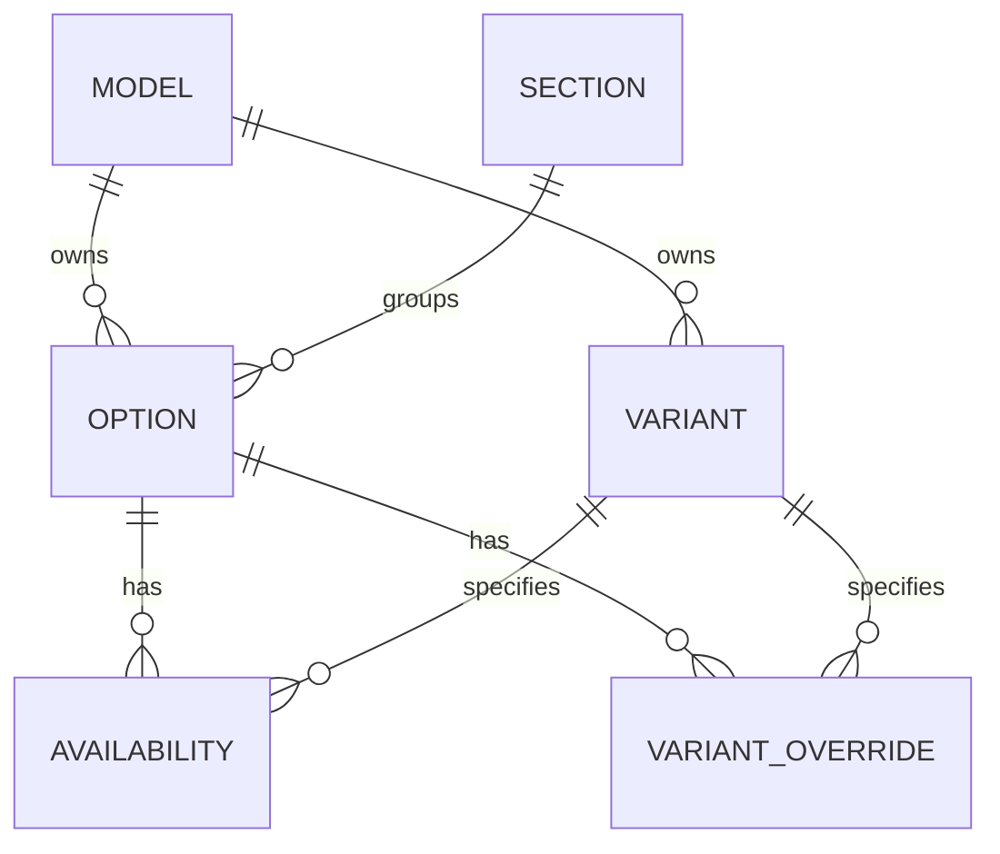

# Workbook-to-database translation blueprint

September 6, 2026. **Design for discussion; current SQLite schema remains a disposable candidate, not the final authoring or release design.**

The workbook data and intended form logic define this migration. The database structure must represent them correctly. Existing code is behavioral evidence, not authority to override an owner clarification. Changing table boundaries, names, or relationships is allowed in the design; a discrepancy between intended behavior and existing output must be recorded explicitly. There is no production catalog database to preserve at this stage.

This document brings together the source families, implemented destinations, runtime meanings, and a concrete option-consolidation proposal. It does not authorize or apply that schema change. The earlier [Checkpoint A specification](source-schema-specification.md) supplies source-field detail and broader project planning; its proposed entity boundaries are not requirements to retain redundant tables.

## Start with an actual option

`stingray_options`, Excel row **128**, contains Z51 Performance Package:

| Workbook field | Actual value | Proposed owner |
|---|---|---|
| `option_id` | `opt_z51_001` | Option identity within Stingray |
| `rpo` | `Z51` | Same option row |
| `option_name` | Z51 Performance Package | Same option row |
| `description` | Package description listing J55, FE3, G0K, G96, M1N, T0A, QTU, V08 | Same option row |
| `price` | 5395 | Same option row, base amount |
| `section_id` | `sec_perf_001` | Same option row, reference to section |
| `selectable` | true | Same option row |
| `display_order` | 30 | Same option row |
| `active` | true | Same option row |
| `display_behavior` | blank | Same option row; preserve blank semantics |

The current candidate spreads this row across `option_definition`, `offering`, `offering_code`, `offering_price`, `offering_policy`, and `offering_presentation`. It even stores the name and description twice.

**Proposal: replace that six-table split with one model-owned `option` table.** Its fields are the workbook fields above plus its database identity and model reference. Preserve the existing `(model, option_id)` identity. Retarget availability, overrides, rules, assets, and evidence links to that owner. The base price belongs here; conditional price changes remain rules.

Evidence: all 1,379 offerings have separate definitions; none shares a definition with another offering. All 1,379 presentation names/descriptions equal their definition copies. Each offering has one base-price row and one policy row. There are 1,224 code rows, with at most one per offering; 155 options have no RPO. The current base-price basis is always `option`, with currency unspecified. These observations do not justify six independently maintained owners.

A table can contain several attributes of the same thing. The useful question is **“what identifies this row, and which fields belong to that identity?”** Splitting name, price, and selection behavior into separate one-to-one tables does not by itself improve the design.

Z51 still has multiple *relationships*, which remain separate:

- Availability: six option/variant records say it is available on Stingray's three trims in both bodies.
- `rule_mapping!109`: selecting Z51 includes J55, Z51 Performance Brakes.
- `rule_mapping!67`: FE4 suspension requires Z51.
- `price_rules!2`: selected Z51 makes TVS Low Profile Rear Spoiler and Front Splitter cost zero.

The description is customer copy. The inclusion and price rows execute the behavior; the application does not parse the description to discover those rules.

This is the proposed option area, not an export of the implemented schema. Rule tables additionally reference options and, where applicable, interiors.

## Complete source-family map

Read `offering` below as **a model's option**. These are existing database names, not additional business concepts. The current [importer](../catalog/importer.py) resolves the exact sheet names through `model_workbook_sources`; it does not infer them from spelling. The 66 assignments cover 11 roles for each of six models, including shared interior/color sheets.

| Workbook source | Current candidate tables | Meaning and consumer |
|---|---|---|
| `model_master` | `model`, `model_presentation`, `model_fact` | Model identity/year, setup copy and ordered facts; setup screen and dataset metadata |
| `model_registry_promotion` | `publication` | Runtime registry membership, ordering, aliases and default model |
| `model_workbook_sources` | Source routing/evidence; sheet names in `model_presentation` | Import ownership and preserved output metadata; not another editable option store |
| `variant_master` + `model_variants` | `variant` | Body, trim, base price and explicit model membership/order; variant chooser |
| `section_master` | `section` | Section identity, selection mode, required status and base placement |
| Each model's `options` role | Six option tables discussed above | Option identity, copy, base price, placement and selection flags |
| Each model's `ovs` role | `availability` | One status per option/variant pair: standard, available or unavailable |
| Each model's `variant_overrides` role | `variant_override` | Contextual active/selectable/display/section overrides; these are genuine additional relationships |
| `lt_interiors`, `LZ_Interiors` | `interior_definition` | Interior identity, stored amount, trim/seat/material/color details, original flags and source text |
| `model_interior_scope` | `model_interior`, `interior_presentation`, `hierarchy_node`, `interior_hierarchy_member` | Model eligibility, required/included option references, displayed labels/order and ordered hierarchy |
| `PriceRef` | `component_rate` | Component amount keyed by type/code/trim |
| `interior_components` | `interior_component` | Interior's component membership, label/order and reference to its rate |
| Each model's `rule_mapping` role | `direct_rule` | Requires, includes, excludes, and explicit replacement action |
| Each model's `rule_groups` + `rule_members` roles | `group_rule`, `group_member` | Requires-any/excludes-any sets with active members and explanations |
| Each model's `exclusive_groups` + `exclusive_members` roles | `exclusive_group`, `exclusive_member` | At-most-one or exactly-one option sets |
| Each model's `price_rules` role | `price_rule` | Conditional total override, condition identity, target and preserved precedence |
| `default_selection_rules` | `default_rule` | Four explicit default conditions, priority and scope |
| Each model's `color_overrides` role | `color_rule` | Interior + exterior option requires an added option; expanded only into applicable models |
| Scope columns on the rule families | `scope_axis`, `scope_member` | Body/trim/variant scope, preserving original blank/star/token distinctions |
| `context_section_master` | `context_section` | Body/trim chooser behavior and placement |
| `section_presentation` | `section_presentation` | Model-specific section labels, order, step and equipment buckets |
| `runtime_steps` | `runtime_step` | Ordered navigable steps; three missing equipment buckets supplied from existing code |
| `context_choice_copy` | `context_copy` | Context tooltips, with body-specific copy taking precedence |
| Variant body/trim values | `context_choice` | Derived context identities for assets; no independently authored duplicate body/trim list |
| `order_summary_sections`, `step_order_summary_map` | `summary_section`, `step_summary` | Summary names/order and step-to-summary routing |
| `asset_map` | `asset_assignment` | Images and hover images; explicit model assignment takes precedence over shared assignment |
| `rule_phrase_map` | Preserved evidence/disposition | Six historical intake rows, not active form rules |
| `runtime_rule_exceptions` | Preserved empty sheet/header evidence | Zero rows in this workbook; no active exceptions to migrate |
| Five existing Z06 code permissions | `derivation_permission`, `code_evidence` | Approved includes-closure replacements; behavior originating in code, not invented workbook rows |

The remaining eight system/evidence tables are `import_metadata`, `source_sheet`, `source_row`, `entity`, `legacy_mapping`, `evidence_link`, `source_disposition`, and `code_evidence`. They retain import identity, original cells, source locations, mappings and code provenance. They are not eight more customer concepts. Together, the map accounts for the candidate's 40 typed tables and eight system/evidence tables.

The importer retains every original nonempty row and reconciles consumed fields. Original evidence is allowed to repeat a name or price: it records what the source said. It must not become a second editable business owner.

## Rules that must survive the translation

All populated rule families below are already imported. Their omission from an options-only diagram did **not** mean they were awaiting migration.

| Mechanism | Concrete meaning / example | Preservation requirement |
|---|---|---|
| Requires | FE4 requires Z51 (`rule_mapping!67`) | Keep direction; do not turn a prerequisite into an automatic inclusion |
| Includes | Z51 includes J55 (`rule_mapping!109`) | Include closure adds equipment subject to the existing scope, exclusion and selection checks |
| Excludes + replace | 5ZW replaces T0A (`rule_mapping!36`); ZF1 replaces T0A (`!116`) | Preserve `runtime_action`; replacing a selection differs from simply disabling a choice |
| Requires any | 5V7 requires 5ZU **or** 5ZZ (`rule_groups!2`, its member rows) | Preserve OR membership. Generator suppresses corresponding direct requires rows to avoid accidentally requiring both |
| Excludes any | Selected source excludes the applicable members of its group | Preserve group activity, membership and explanation; do not flatten into a prerequisite |
| Exclusivity | LS6 engine-cover group (`exclusive_groups!2`) | At most one selected member; exactly-one groups also participate in missing-requirement checks |
| Conditional price | Z51 makes TVS zero (`price_rules!2`) | Preserve first-match order and browser package-price precedence; zero is an actual amount |
| Default: always | Six current rows | Add viable target subject to scope, selection and exclusive-peer checks |
| Default: unless RPO selected | Black exhaust tips unless NWI (`default_selection_rules!3`) | Condition tests selected RPO, not one arbitrary option row with that RPO |
| Default: unless section selected | Standard suspension (`default_selection_rules!2`) | Use selected/automatically added choices in the specified section |
| Default: when selected unless section selected | Two current rows | Triggering option may be selected/automatic; respect user choice in the target's resolved variant section |
| Color combination | Adrenaline Red + Sebring Orange requires Color Combination Override (`color_overrides!2`) | Interior and exterior jointly identify the condition; added value references an option, despite source column name `adds_rpo` |
| Variant override | Performance Data/Video Recorder rows (`stingray_variant_overrides!2–3`) | Apply nullable contextual fields before resolving display, selection and section behavior |
| Section requirement/default | Required single-choice sections | Preserve missing-requirement checks and initial selection of a sole selectable standard choice |
| Derived replacement | Five Z06 permissions: T0F, T0G, Z07, PDD, PDF → CBF | Keep exactly the existing approved includes-closure derivations; do not broaden inference |

Current stored counts: 783 direct rules; 163 groups/1,012 members; 61 exclusive groups/195 members; 297 price rules; 28 defaults; 1,528 model-qualified color rules; five derivation permissions. Counts establish coverage, not correctness by themselves.

Scope semantics also belong to the blueprint. Direct-rule body scope uses exact equality when nonblank. Group/default/price matching uses pipe-separated exact tokens; blank or `*` matches all. Preserve case, token order and blanks through generation rather than silently normalizing existing behavior. The database's common scope storage does not make every consumer's interpretation identical.

## From stored facts to the same behavior

The database becomes the business-data source. Algorithms still apply that data. Moving to SQLite does not require reimplementing selection reconciliation as SQL triggers.

1. The importer translates workbook records and existing code-owned permissions into the candidate database, retaining evidence.
2. [Contract generation](../catalog/contracts.py) reads typed catalog tables directly, applies availability/variant overrides, assembles rules and interiors, and emits the same form contract and registry. It does not rebuild Excel.
3. The existing browser behavior consumes the contract. Preserve its order of operations, prices, disabled reasons, defaults, equipment, summaries and submission payload.

The inspected behavioral reference is [27vette `app.js` at the frozen commit](https://github.com/seanzmc/27vette/blob/4fe92a4f078370c478f18484cad31bdafe58ad43/form-app/app.js). Key algorithms:

- **Selection reconciliation** (`reconcileSelections`, line 1811): remove exceptions/replacements/invalid selections, reconcile interior, compute automatic additions, remove newly invalid selections and duplicate/locked defaults, recompute automatic additions, add workbook defaults, add generated defaults, then deduplicate selected RPOs. Preserve this sequence.
- **Automatic additions** (`computeAutoAdded`, line 1018): traverse inclusion closure with the existing availability, prerequisite and exclusivity checks. Color additions follow that closure and depend on the selected interior and explicitly selected exterior. Do not silently rerun generic closure afterward.
- **Option pricing** (`optionPrice`, line 1191): package component delta first, selected package minimum base next, then first matching ordinary conditional override, then base price. Rule ordering is data with behavioral consequences.
- **R6X requirement, verified against source and runtime:** selecting a qualifying interior adds R6X once, without offsetting another price. The [completed R6X review](model-rule-review.md#executed-r6x-review) exercised 90 model/interior memberships in both bodies. All 48 AE4 cases omit the 595 seat charge; 132 AH2 cases match because the seat costs zero. R6X and other components are correctly charged, and 96 lifecycle checks pass. The new consumer must total the independently resolved seat, R6X and extras once each; R6X component membership must not mean seat replacement. This is an identified correction to frozen behavior, not a workbook price change. No pricing code was changed in this review.
- **Presentation**: `auto_only`, `hidden`, and `display_only` change emitted availability/selectability/visibility according to `contracts.display`. Standard equipment remains a nonnavigable bucket. Explicit model assets and body-specific tooltips retain their precedence.

Amounts remain exact decimal text in the candidate. Existing contract conversion rounds to whole dollars with ties-to-even and emits zero for null; that output behavior does not authorize converting unknown stored prices into known zero prices.

## Ownership decisions and design boundaries

**Concrete first structural change for review:** one model-owned option row replacing the six-table split above. Keep availability and variant overrides as separate relationships. Keep distinct rule families because they perform distinct operations. Keep workbook IDs model-qualified; RPO is not a unique product identity (`grandSport_options!74` and `!126` both use T0E with different behavior).

For interiors, the source already has real shared definitions and model memberships. Retain that distinction. The one-to-one split between `model_interior` and `interior_presentation`, repeated component descriptions, and repeated hierarchy labels deserve their own field-ownership review before final DDL; this document does not claim those boundaries are approved. The [earlier audit](workbook-structure-audit.md) identifies concrete repetitions to investigate. Matching text across models alone is insufficient authority to merge identities.

Future release/versioning, editing UI and visualizer design do not justify extra option owners in this migration. They remain separately scoped work. A drawDB view or diagram is a reading aid; it never becomes a competing schema authority.

## Evidence and completion standard

The inspected workbook SHA-256 is `3127e663b1531e366ce86b989b6190914108d40dfd15a33a258307a05d608e3c`, matching the frozen baseline and candidate import. It has 77 sheets, 15,134 populated rows, 32 variants and 7,448 availability pairs. The reference code revision is `4fe92a4f078370c478f18484cad31bdafe58ad43`.

For this documentation task, read-only profiling verified the option duplication and unchanged workbook hash. A fresh `catalog.parity.compare` against `.local/checkpoint-d/final.sqlite` passed all six generated contracts and the registry, excluding only generation timestamp. The earlier [form parity report](../catalog/form-parity-report.json) records 32 variant states, 126 option transitions and 32 interior transitions. Those browser/runtime checks were not rerun for this documentation change; they are sampled behavior evidence, not exhaustive combinations.

Before accepting a revised schema, compare source identities, values, memberships, null semantics, rule direction/AND/OR meaning and precedence—not only row totals. Regenerate the same contracts and exercise affected selection/price paths. Review each proposed owner against actual workbook rows during the change, so redundancy is found before calling the design finished.

This maps current source families and major behavior mechanisms, with an explicit first consolidation proposal. It is **not complete model-specific behavioral coverage, final DDL, or a claim that every remaining table boundary has passed ownership review**. The [model-specific review](model-rule-review.md) identifies concrete differences and untested obligations. No application schema, workbook data, runtime behavior, dependencies, hosting or synchronization changed with this document.
